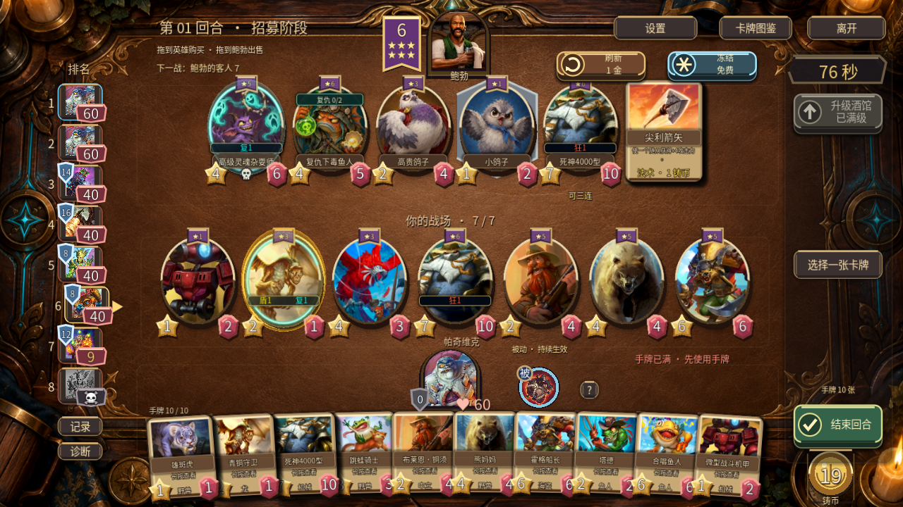
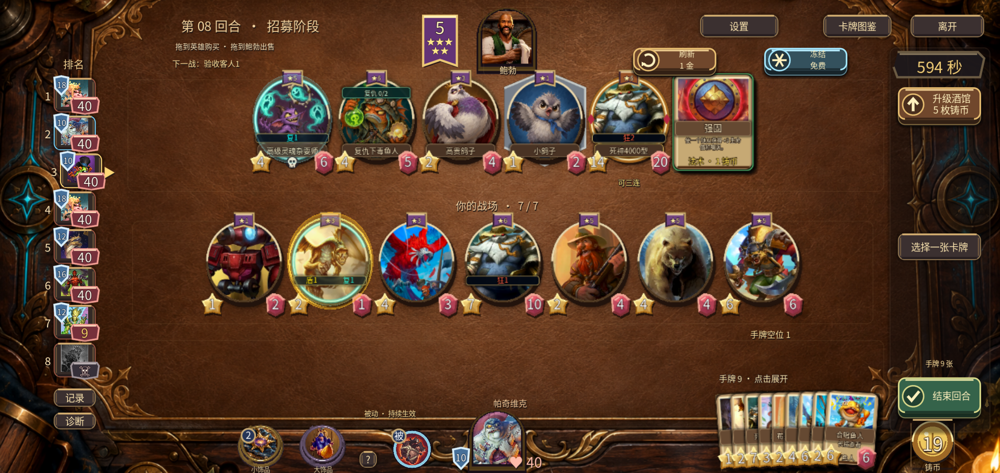

# v0.46.0 · 台面与信息层级

本轮处理 issue #19、#20，并继续 #18 的实景对照。电脑与手机的微扇形手牌规则不变。

| 真实战棋参考 | 当前发现 | 本轮改进与验收 |
|---|---|---|
| 台面和外围木框构成一个场景，卡牌是焦点 | 3D浅色矩形台面覆盖已有深色背景，2D与3D风格割裂 | 复用现有深色酒馆美术作为3D台面材质，保持投影和卡牌厚度；对照两种比例、3D与2D |
| 鲍勃旁的酒馆等级是明确的紫金徽章 | 沿用随从角标绘制，星级文字只有12号 | 独立放大酒馆旗章，真实星数加等级大字，点击可读当前等级与升级费用 |
| 铸币集中在一处，操作费用单独标注 | 小金币排、金币大数字和回合提醒三处重复 | 余额集中于右下金币；点击显示基础收入、下轮收入及余额规则；费用保留 |
| 头像、生命、护甲各有清晰轮廓 | 左侧生命文字压在头像上，护甲需要打开详情 | 独立红色生命座与蓝色护甲盾；低生命、淘汰与下一对手有明确状态 |

已完成相关功能回归、原生截图及最终安装包操作检查，范围与日志见 [验证记录](validation/v0.46.0/VERIFICATION.md)。功能和视觉检查不等于平衡测试，模拟器不等于实体手机长局表现。

## 实拍对照

原来3D层的浅色板盖住了深色背景；左侧血量压在头像上，余额在多处重复：

本版保持牌面位置与微扇形手牌，改为一体深色台面、独立酒馆旗章、血甲标识和单一金币余额：

手机仍默认右下收纳，点击后整排放大；详情、发现、饰品优先显示。新增生命标识整个范围都能点击，包括伸出头像框的右边缘。

实际小屏检查还修复了公共详情长文字越界：金币说明、对手技能和饰品说明使用可滚动文字区，始终为返回按钮留出空间。

实现复用原有背景资源，未新增写实素材或额外渲染视口。台面纹理按屏幕与原画比例居中裁切，避免宽屏拉伸、错位；参考 [Godot 4.6 spatial shader](https://docs.godotengine.org/en/4.6/tutorials/shaders/shader_reference/spatial_shader.html) 的屏幕坐标和材质接口。卡牌和英雄继续使用3D对象；这些改动不构成长局帧率保证。

仍与原作有差距：主菜单/房间/图鉴的普通矩形布局、卡牌说明字体密度、三连奖励声音与节奏、不同实体手机上的热量和触控遮挡。本版不将这些未完成项计为解决。

后续继续主菜单木牌、房间座位、图鉴册页、三连节奏及声音；#17音乐资源和实体手机长局反馈仍单独跟进。
