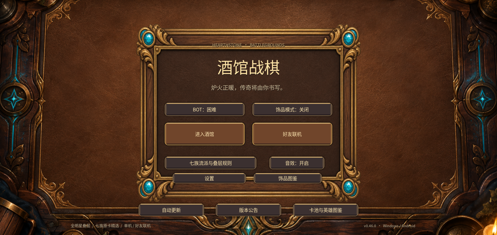
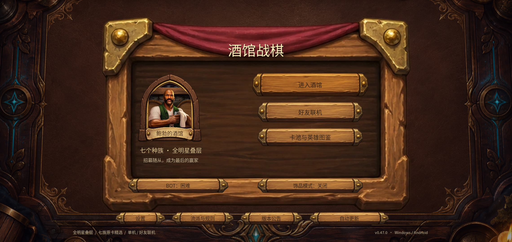
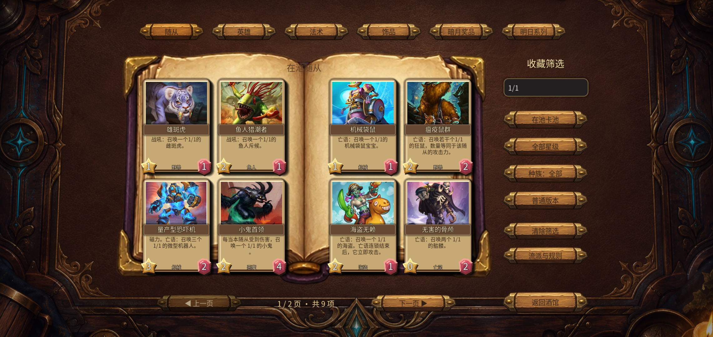
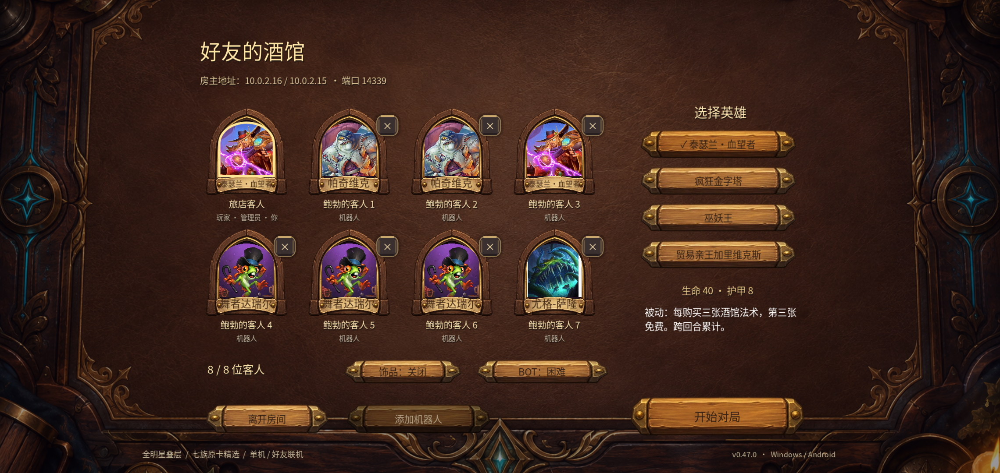

# v0.47.0 · 酒馆入口、房间与收藏册

接续已确认的 #18 计划。上一轮完成 #19/#20，本轮不改动卡池平衡与战斗规则，保留双端微扇形手牌。

## 真实界面对照与设计

| 参考与实际差距 | 本轮实现 | 验收证据 |
|---|---|---|
| 真实战棋入口以英雄画面、实体木架和主操作构成主次；v0.46多个相似矩形按钮挤在厚金框中 | 用简化手绘木架承载英雄展示和两条主要入口，次要功能分组为收藏/规则/设置/公告 | 主菜单16:9、20:9和安卓实际点击 |
| 真实收藏使用纸页、分类、翻页与焦点详情；现有图鉴一次生成数百张卡且长列表密集 | 有界分页收藏册、搜索、种族/等级筛选，保留金色与在池/退役/衍生物分类，英雄采用肖像册与详情 | 每个条目可达、筛选无漏卡、分页返回、长说明 |
| 现有联机大厅只有文字席位，缺少玩家身份感 | 八个固定席位显示英雄、昵称、玩家/BOT/管理员；明确自己与空座，英雄选项保留 | 房主/访客权限、八人满房、加删BOT与开始 |
| 表单与战场材质割裂，按钮只是颜色块 | 木质按钮与纸面输入，悬停高亮和压入反馈；装饰不截获点击，不增加常驻动画 | 点击边界、键盘焦点、减弱动态与手机触控 |

参考：玩家上传的实际桌面与手机战棋图（2026-09-14纠正手牌布局）；[2021战棋入口与收藏实机截图](https://outof.games/news/3429-first-look-at-hearthstones-battlegrounds-new-interface-for-cosmetic-heroes-and-bartenders/)。后者仅用于历史风格与结构对照，不宣称为当前最新版UI。

## 实施步骤

- [x] 生成并检查2×2手绘图集：木架、空白收藏册、木按钮、座位框；裁剪过程与位置映射保留。
- [x] `scripts/foyer_ui.gd` 与 `scripts/foyer_art.gd`：承接主菜单、联机表单与大厅；原有命令和权限不变。
- [x] `scripts/collection_ui.gd`：按页创建卡牌/英雄，集中分类、搜索与返回逻辑；对局快照不打断输入，招募计时继续。
- [x] `tests/foyer_v49_test.gd`：验证路径可达、房间权限、分页筛选完整性、详情不溢出、快照保持图鉴与返回当前阶段。
- [x] 原生窗口16:9/20:9截图，查看生成素材在实际尺寸中的裁切、文本、按压与遮挡。
- [x] 最终APK模拟器实际进入菜单、设置、图鉴、好友房间、单机首轮；Windows联机同步；不把模拟器当作实体长局验证。
- [x] 更新仓库/游戏内公告、下一阶段计划、发布附件和验证证据；回复#18并保留未完成部分。

架构：由独立展示模块调用现有房间与规则入口；分页和搜索仅保存本地浏览状态，不发送游戏动作。布局使用当前1440×900逻辑画布和居中适配。新增图像保存在项目assets目录，源图集与提示词放references目录，不将源图集打入安装包。

## 实际验收

15套相关回归266条断言通过，原生窗口新套件41条通过，19张原生截图、32张最终APK截图和55秒操作录像归档在[验证目录](validation/v0.47.0/README.md)。最终Windows EXE同机双进程同步通过。最终APK在安卓API33模拟器安装，首回合实际买牌、点击展开和拖牌上阵；安装文件SHA256与发布附件一致。

模拟器从收藏返回战场出现短暂重绘等待。单次点击连续取样确认可返回，不需要二次点击；0.3秒取样仍为收藏，1.5秒取样已为战场，取图本身约1.1～1.4秒，因此不把它当成精确帧率测量。详见[验证边界](validation/v0.47.0/VERIFICATION.md)。

仍需后续：返回战场的重绘等待、旧功能页面统一、英雄详情返回文案和长技能换行、三连声音与节奏、音乐资源、实体安卓发热与帧间隔、战斗中不同叠层特效的主次。仓上#17已由维护者关闭，保留其状态，音乐资源另列待办；#18继续开放。
