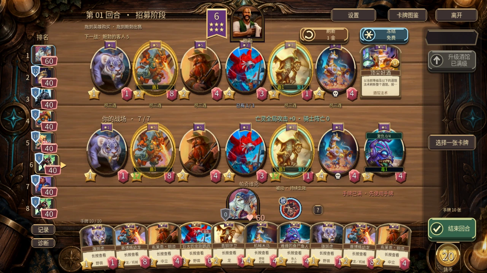
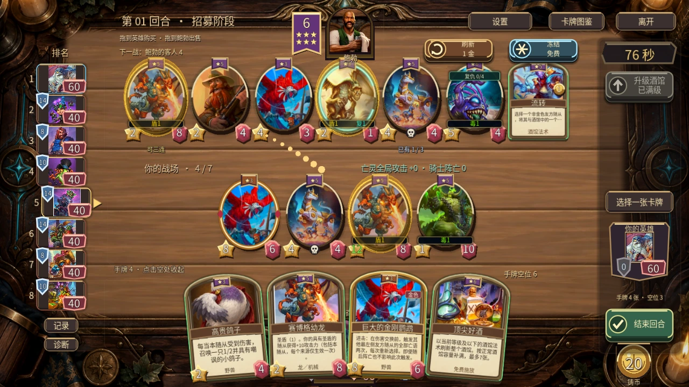

# #18：共享拱顶卡面、手绘材质与微扇形回归

2026-09-17。本轮为 v0.50.0 开发实现，公开安装包仍为 v0.49.0；没有发布新的 APK/EXE，不代表 Android 真机验收。此前十二张随从与四法术的规则实现未改动，不做胜率模拟。

对照采用用户提供的三张真实酒馆战棋截图（电脑底部中央、手机右下收纳与展开），再实际启动 Godot 4.6.1 截取当前项目。下方图片全部来自真实原生运行，图集仅用于材质，不是成品效果示意图。

## 差距与本轮处理

| 观察项 | 改动前与参考图的差距 | 本轮实现 / 剩余差别 |
|---|---|---|
| 手牌轮廓 | 方盒和普通圆角，像信息面板 | 共享拱顶轮廓，边缘分为厚外缘、暗内缘和上沿高光；细部雕刻仍比原版简单 |
| 插画窗口 | 横向矩形，边框与画面割裂 | 拱形画窗，真实Atlas区域和焦点等比裁切，保住主体比例 |
| 卡名 | 平直横条，长名拥挤 | 轻弧皮革名条，文字沿浅弧，长名适配并支持完整详情 |
| 说明 | 小纸面与装饰竞争 | 浅色纸页、深色正文，按实际字宽换行和省略；详情旁保留完整滚动说明 |
| 普通 / 金色 | 边缘过于相似 | 哑金材质、暖色高光、独立金色标记和局部扫光；未来仍可加强不规则金属造型 |
| 星级 / 费用 | 部分标记可能挤占同一区域 | 星级居中，金色/原创分居肩部，法术价格独立；已购手牌免费施放 |
| 双种族 | 窄手牌文字太挤 | 必要时用两行完整显示，避免小卡省略掉第二个种族 |
| 3D 卡体 | 画面变拱形也可能露出矩形侧壁 | 侧壁、扫光网格、接触阴影共用拱形；转动阴影随牌转，静置不重建 |
| 桌面 | 密集细纹和高对比金边抢眼 | 宽木板、低频笔触，降低外缘亮度；2D/3D共用配色/裁切，仍保留原有酒馆装饰 |
| 手牌位置与手感 | 必须遵循用户实际截图 | 电脑底部中央常驻，手机右下收纳后首次点击只展开；保留轻弧、小倾角、适度重叠，未改直排或大扇面 |

另修复了复用卡面 `setup()` 累计连接鼠标和输入回调的问题。牌面、几何和纹理各自复用，未新增每帧CPU图片处理。

## 实际截图

同一24卡固定场景，改动前：[电脑](card-surface-baseline-desktop.webp)、[手机展开布局](card-surface-baseline-mobile.webp)；改动后：[电脑](card-surface-after-desktop.webp)、[手机展开布局](card-surface-after-mobile.webp)。这里的“手机布局”是在Windows原生窗口中强制平台布局，不能替代Android设备。

更多：[十牌展开](v50-surface-mobile-ten.webp)、[默认右下收纳](v50-surface-mobile-folded.webp)、[发现](v50-surface-discover.webp)、[饰品](v50-surface-trinkets.webp)、[收藏](v50-surface-collection.webp)、[详情](v50-surface-detail-cyborg_drake.webp)、[长名长文](v50-surface-detail-long-text.webp)、[20:9 3D](v50-surface-mobile-wide-3d.webp)、[20:9 2D](v50-surface-mobile-wide-2d.webp)。23张截图的原始像素尺寸、PNG来源哈希与WebP哈希见 [screenshots.json](screenshots.json)，仅转换文件格式，无修图或拉伸。

材质使用内置 `image_gen` 一次生成2×2图集，实际1254×1254，每格627×627，前三格等比缩至512；四份WebP共约79KB。保留[图集预览](material-atlas.webp)、[提示词](prompt.txt)、[原图与裁剪映射/哈希](atlas-map.json)。源码仓原图位于 `assets/generated/v50-ui/source/`，由`.gdignore`隔离；运行时只加载四份材质。

## 功能与性能验证

9项相关回归全部通过：8项Windows原生脚本共271条检查，另1项headless几何/边界/网格方向/回调复用测试。包含本轮28条、双端平台63条、宽屏68条、3D呈现22条、触感14条、磁力三连11条、多族UI32条、四法术33条。详见 [results.json](results.json) 和同目录日志；本次无脚本/shader错误或退出警告。先规格、后独立代码质量审查均通过，[审查记录](review.md)。

真实输入覆盖购买、出牌、实体重排、无效目标回撤；4/10手牌、首次展开、点空白收回、2D回退、发现/饰品层级和收藏返回均通过。测试用局面固定部分卡牌，未用自动对局推导平衡结论。

Windows / RTX 5060 Laptop / Godot 4.6.1 Compatibility，1280×720、中等画质，24个卡牌actor，预热后每种布局120帧。五次收藏往返，首帧延迟由调用返回渲染到`frame_post_draw`测量。数据为短样本、受帧率上限影响，不是纯GPU计时，也不代表安卓流畅度。

| 指标 | 改动前 | 改动后 |
|---|---:|---:|
| 电脑静置平均帧间隔 | 16.388ms | 16.390ms |
| 电脑静置P95 | 16.481ms | 16.474ms |
| 手机展开布局平均帧间隔 | 16.387ms | 16.390ms |
| 静置卡面重绘 | 0 | 0 |
| 收藏返回调用平均CPU耗时 | 13.253ms | 13.506ms |
| 收藏返回首帧平均 | 33.422ms | 38.363ms |
| 收藏返回首帧范围 | 31.827–35.962ms | 36.108–40.341ms |
| 五次返回actor保留 / 节点数 | 保留 / 516 | 保留 / 516 |

原始数据：[baseline](card-surface-baseline.json)、[after](card-surface-after.json)。卡面与节点复用有效，但返回首帧约增5ms，不能宣称本轮提升性能。后续先在Android验证并采样，再按实际瓶颈调整纹理上传或返回绘制。

本地重跑：`python tests/run_card_surface_v50.py --godot <Godot-console路径>`；性能脚本为 `tests/card_surface_perf_v50.gd`，`--output=<json路径>`。新测试开始时首次误将“购买后UID还在手中”用于第三张赛博格，正常三连会替换UID；已换成不触发三连的布莱恩以检查纯购买路径，另有磁力/三连回归。

## 下一步及 issue 状态

- #18 保持开放：继续原版式随从/英雄边框的形体、侧栏和按钮统一、三连奖励节奏与音色，以及Android长局帧率/发热。不能以本轮局部截图宣称完全复刻。
- #25 内容开发已实现；完整v0.50仍需修正全局卡池生成器旧口径、同步版本、输出APK/EXE、Android安装/触控与发行包联机检查后回复关闭。
- 源码提交与公开证据提交在后续 `publication.json` 记录；源文件哈希使用LF换行归一化，见 `source-files.json`，证据文件SHA-256见 `manifest.json`。
