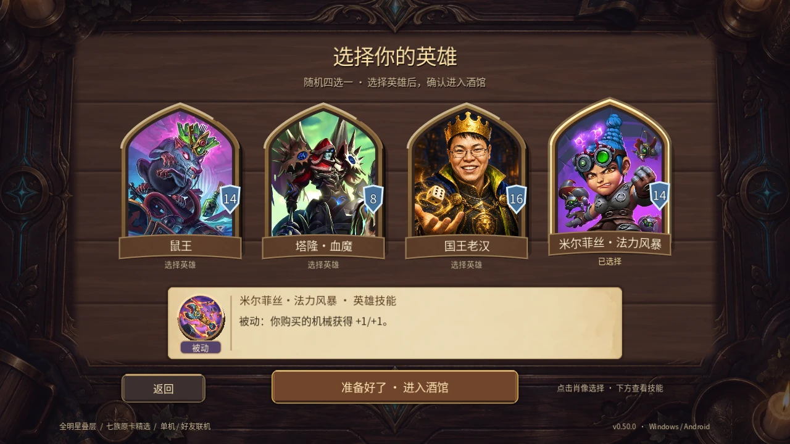
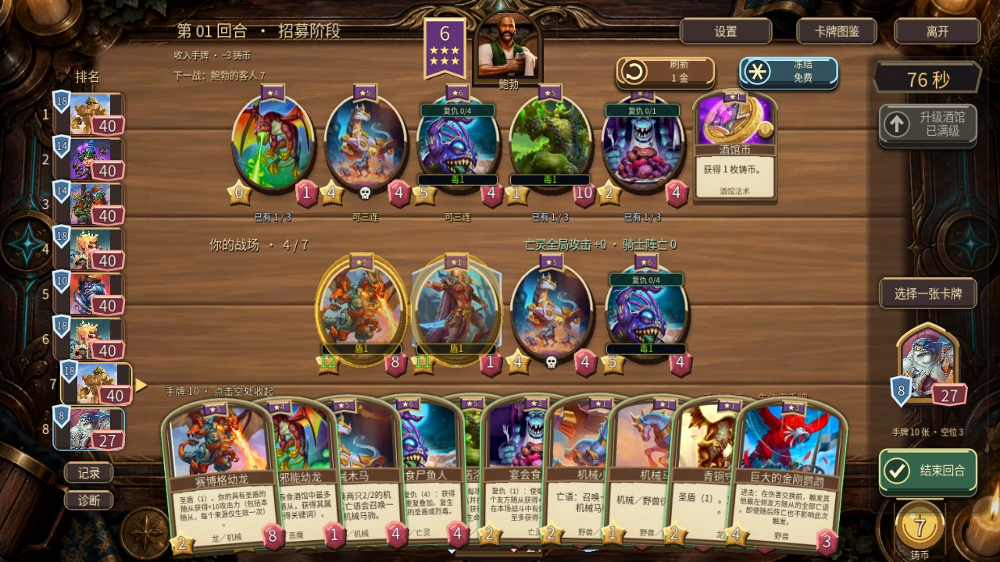
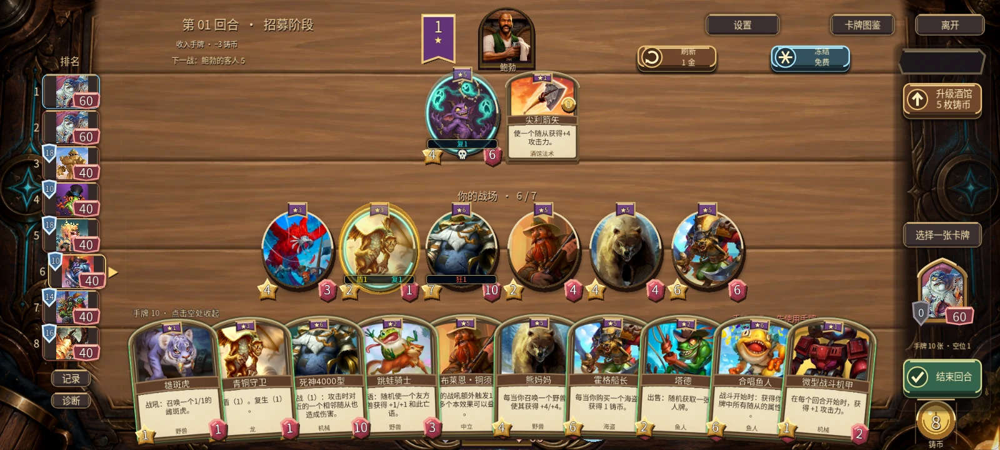
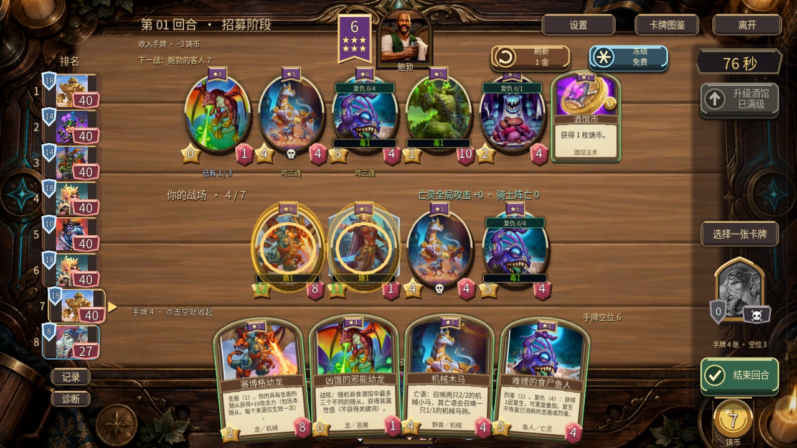

# 英雄界面阶段验收（v0.51 开发）

2026-09-17，Godot 4.6.1 / Windows 原生窗口。正式公开版本仍为 v0.50.0；本目录是后续开发证据，不是新版 APK 或实体手机验收。

**续检更新：** 用户确认额度恢复后，重新完成独立质量审查，结论PASS；独立复跑英雄选择和手机血甲两套headless测试通过。原生画面仍引用本目录已保存证据。下文额度限制为上轮历史记录，已不再是当前未完成项。

## 真实参考与实际差距

实际查看暴雪[第9赛季英雄选择 GIF](https://news.blizzard.com/en-gb/article/24159389/announcing-battlegrounds-season-9)及[2019年英雄选择介绍](https://hearthstone.blizzard.com/en-us/news/23156373)。官方画面用于研究四个独立拱形肖像、护甲位置、姓名条和统一确认；媒体地址及哈希见 references.json。参考图没有加入游戏资源，也没有移植付费重抽。

玩家提供的 6c984d0c 批次实际战棋截图用于对照双端战场：电脑底部中央常驻，手机右下收纳、首次点击仅展开为微扇形。它们不是英雄选择页参考。

|位置与优先级|此前实际呈现|原版参考的关键差距|本阶段处理|
|---|---|---|---|
|单机选英雄 P1|四列矩形肖像和长说明|头像应为独立实体，名字和护甲从图中分离|微尖顶拱框、厚暗侧壁、局部暖高光、姓名条与独立护甲|
|技能阅读 P1|各列文字密集、长技能易被截断|选择肖像和阅读效果需要明确主次|共用选中技能纸页，图标、费用/被动及可滚动全文|
|选择反馈 P1|点击重建整页|选中和开局应是连续但独立的动作|稳定节点、轻抬/回弹、单独确认、减弱动态|
|手机展开血甲 P1|右侧小矩形工具牌|战场上英雄应延续拱形肖像和独立血甲|保留只读信息，改为紧凑英雄拱框|
|手牌排列 P1|已采用双端微扇形|不能因“平铺”变成水平直排|本阶段保持既有浅弧、轻斜与适度重叠，检查4/10手牌及遮罩|
|桌心和边沿 P1|木板重复纹理、边框细节较密|原版桌心更安静，厚边缘负责空间感|留待下一阶段，先记录明暗与纹理对照再制作图集|

## 验证记录

8套 Windows 原生回归合计 **327 条成功检查、0失败**，运行清单见 [suites.json](suites.json)，完整日志见 logs。计数按唯一套件计算，不把补拍、相同套件重复运行或另一分辨率重复断言累加为新覆盖。

|套件|成功检查|重点|
|---|---:|---|
|hero_draft_v51_test|114|22英雄、点击/触摸/键盘、滚动、取消、微尖顶拱框、确认身份|
|offline_ui_test|7|正常单机入口和7个BOT|
|ux_v7_test|12|更新检查、英雄选择及既有操作|
|issue_ui_v20_test|8|选项不重抽与既有UI行为|
|second_six_ui_v50_test|32|手机4/10手牌、只读血甲、结算时序、死亡、观战、模态隐藏、实际拖牌|
|hand_platform_v47_test|63|双端微扇形、16:9/20:9、十手牌逐张命中、发现及2D回退|
|layout_v46_test|68|16:10/16:9/20:9、3D投影、饰品确认、战斗/结算和窗口变化|
|audit_v45_test|23|原生各页面、购买/出牌/重排、菜单公告、战斗与回退|

新增英雄界面另外检查过1280×720和1600×720；较早20:9日志为108条，后续增加混合输入检查后为114条，不能把旧日志称作新114条。父线程默认窗口1280×800也已通过。截图尺寸、来源和SHA-256见 [screenshots.json](screenshots.json)，共26张实际截图，包含全22英雄分组。测试使用真实场景和输入分发，固定手牌及较长招募时间只用于可复现检查，不是自然长局或性能基准。不运行胜率平衡模拟。

独立规格审查发现一次混合输入误选：鼠标按住时，未按下过的空格松开会提前选择英雄。已分开鼠标、触摸与键盘的按下状态，失去焦点时取消；新增回归先实际失败（109成功、5失败），修复后114条全部通过。原始复现和修复日志分别保留。

补拍死亡/观战画面时，测试恢复状态后在节点处理前便检查发现窗口，引入一次过早断言。保留 capture-timing-before 日志；等待界面完成下一帧处理后32条通过。未为此修改游戏逻辑，未删除原有断言。

英雄选择独立规格复核通过。独立代码质量审查启动后遇工具额度限制，未获得结论；本线程逐项检查了输入取消、原图等比裁切、稳定节点、只读血甲来源和回放时序，继续完成运行验收。手机徽座由本线程实现和复核，**不把这些工作声称为独立质量审查通过**；正式发布前仍需补齐独立复核。

## 实际画面

另有 before-hero-draft / before-mobile-ten 对照、全部英雄分组、四手牌、2D、详情、发现、饰品与游戏内开发公告。全部使用角色自身原图和既有共享材质，没有新增或替换角色插画。

实体 Android、最终安装包、真实音频实听和外部双设备联机不在本阶段原生窗口验证范围。#18 持续开放，尚未完成的材质、声音和长期性能工作不标为已修复。
