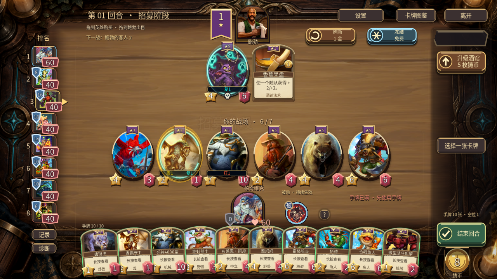
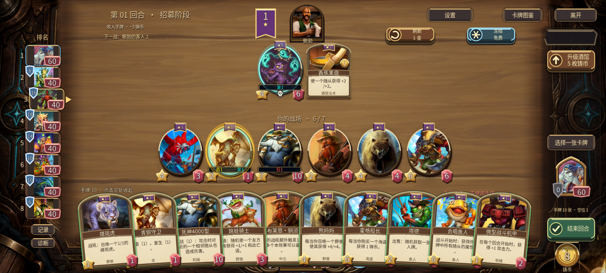
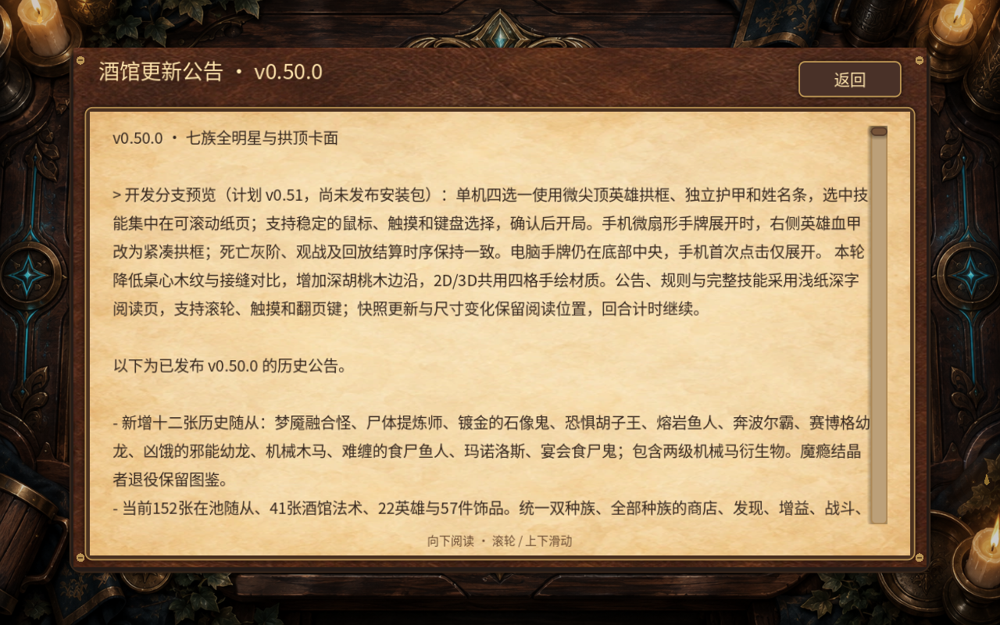

# v0.51 开发：桌面与长文阅读

继续开放问题 #18，正式下载版本仍是v0.50.0。本阶段不发布新APK，不调整卡池、胜率或战斗规则。

## 从真实截图到改动

再次查看玩家6c984d0c批次实际战棋手机截图，和本作上一阶段手机十手牌、公告页面的实际截图；没有把生成的界面效果图当作官方实机证据。

|问题与位置|此前差距|本阶段设计|仍然需要继续|
|---|---|---|---|
|桌心 P1|均匀横向拼板接缝和木纹较强，与随从争夺注意力|只保留少量宽板接缝，压低纹理对比，暖棕桌心与胡桃木边沿平滑连接|外围装饰仍较密，不能称作完全还原原版|
|边沿 P1|边缘与桌面明暗衔接偏平|共享材质里加柔和暗边与克制方向高光；保留实际3D板厚|实体手机帧耗时仍需实机测量|
|公告/规则 P1|白字贴近深底边框，宽行密集，手机阅读费力|独立标题/返回、浅暖纸页深色文字、正文留白、竖向完整阅读|饰品、奖品和历史记录的旧页面另列后续|
|阅读连续性 P1|对局快照可能冲掉正在读的页面或重置技能说明|保留阅读页与滚动位置，内容变化更新文本；回合继续运行|外部双设备真实延迟仍需独立验收|

## 素材

内置image_gen一次生成2×2材质图集。请求2048方图，实际返回1254×1254，按实际格位裁切，各边1px安全内缩，输出625×625 WebP；没有拉伸角色、重新上色或覆盖旧材质。左上桌心、右上边木、左下纸页、右下皮革。提示词、映射、哈希和图集预览随证据保存；游戏实际引用四张独立裁图。原始生产文件位于本地references/v51-ui，游戏源代码不上传公开发行仓库。

## 审查和验证范围

用户恢复额度后，补齐英雄界面的独立质量审查，PASS。该审查重新跑了两套headless回归，输出存在工具执行记录，没有新增磁盘日志，不虚构日志文件。本目录新增审查与原生检查另行记录。

桌面先通过规格审查，再通过质量审查。质量复核发现零向量normalize只加偏移并不能彻底消除零点，已改为按正数下限除法；复验原生28条通过，包括2D/3D三个未遮挡采样点颜色差阈值检查。新增一次边木纹理采样，没有新视口、灯光、粒子或每帧场景重建；这不是手机性能提升证明。

原生测试使用可复现固定场景与输入分发；手机布局覆盖不等于Android实体设备验证。保存实际截图，并明确每套日志来源。不运行平衡模拟，未实听声音，未修改电源、驱动、代理或网络设置。

## 完成结果与回归证据

阅读页规格与质量复核均通过。质量审查抓到英雄结算完成直接重绘战场的边界问题：玩家已打开公告/规则/技能时，计时完成或3D延迟收尾可能把页面清掉。已将计时收尾、2D动画完成、3D延迟完成三处统一经过页面路由，保留结算完成标记、权威伤害和战斗阶段。修复前新增场景3项失败，修复后headless与原生各31项通过。测试中旧节点释放后与null比较可能误判，已显式检查节点存在与有效性。

本阶段 **5 套 Windows 原生回归，213 条成功检查**，退出码均为0，无脚本/着色器错误。仅计各套件最后一次通过；headless、修复前失败、重复运行不累加。手牌/入口检查在结算路由修正前完成；修正后重新运行阅读页与包含正常英雄结算的宽屏布局检查。

|套件|成功检查|证据|
|---|---:|---|
|reading_page_v51_test|31|[原生日志](logs/reading_page_v51_test.log)|
|hand_platform_v47_test|63|[原生日志](logs/hand_platform_v47_test.log)|
|layout_v46_test|68|[原生日志](logs/layout_v46_test.log)|
|audit_v45_test|23|[原生日志](logs/audit_v45_test.log)|
|card_surface_v50_test|28|[原生日志](logs/card_surface_v50_test.log)|

滚轮测试曾仅发出按下事件，导致测试中的GUI鼠标捕获未释放；补齐匹配的松开事件后通过，生产代码没有加入伪造鼠标事件或全局清理输入的补丁。

## 实际画面

[全部截图尺寸与SHA-256](screenshots.json) · [测试汇总](results.json) · [审查记录](review.json)。30张截图包含改前参考及本轮实际渲染；长技能与手机宽屏阅读使用明确标注的合成长文压力文本，公告和规则使用实际完整内容。手机截图由平台布局覆盖生成，不冒充Android截图。

|视图|改前|改后|
|---|---|---|
|16:9桌面3D|[改前](screenshots/table-before-16x9-3d.png)|[改后](screenshots/table-after-16x9-3d.png)|
|20:9桌面3D|[改前](screenshots/table-before-20x9-3d.png)|[改后](screenshots/table-after-20x9-3d.png)|
|公告阅读|[改前](screenshots/reader-before-journal.png)|[改后首屏](screenshots/reader-journal-first.png) / [末尾](screenshots/reader-journal-last.png)|
|规则阅读|[改前](screenshots/reader-before-rules.png)|[改后首屏](screenshots/reader-rules-first.png) / [末尾](screenshots/reader-rules-last.png)|

另存2D回退、详情、发现、饰品收藏和视频设置实际画面。初次桌面改前2D采图助手没有刷新UI状态，因此没有把那两张作为有效基线；改后2D/3D采图均正常刷新。

素材：[原始四格图集](materials/material-atlas.png)、[提示词](materials/prompt.txt)、[裁切与哈希映射](materials/mapping.json)，四张WebP在同目录。本地保留可复现裁切脚本，公开仓库仅提供文档与美术/验证证据。

## 下一步

1. 奖励选择：三连、发现与饰品界面的标题/说明/确认层次、可点击与选中反馈；先检查手机四选一和长效果，不扩大卡池。
2. 演出检查：录屏核对揭牌、英雄攻击、奖励与目标指向的时序；音频需实际可听环境，不把日志当听感。
3. 完成v0.51候选包后统一版本号，导出APK/EXE，做覆盖安装、模拟器触控、普通单机流程和最终客户端同步。当前正式下载仍为v0.50.0。
4. 实体手机长局、外部双设备网络与音频实听继续明确列为待验，不关闭#18的其余范围。
