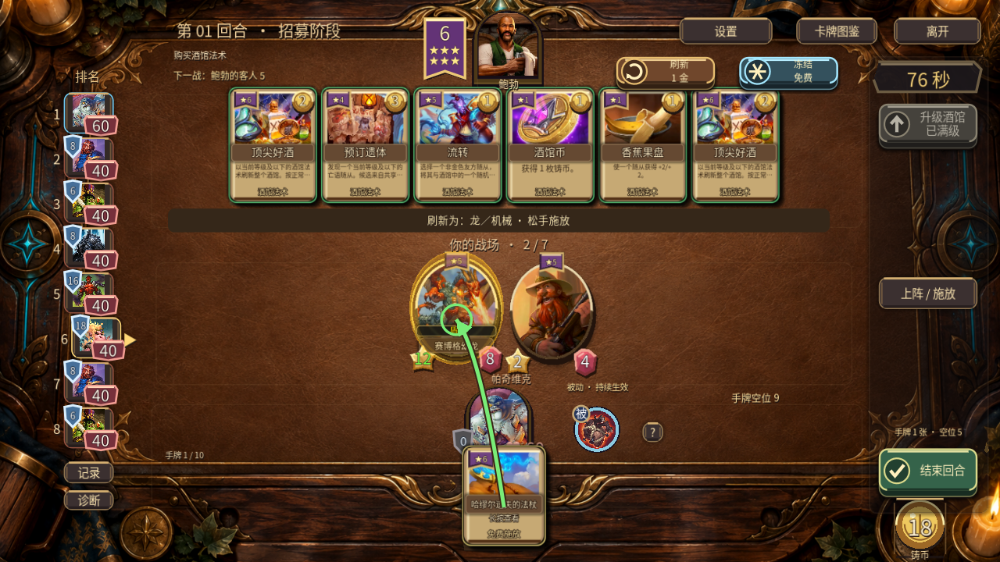
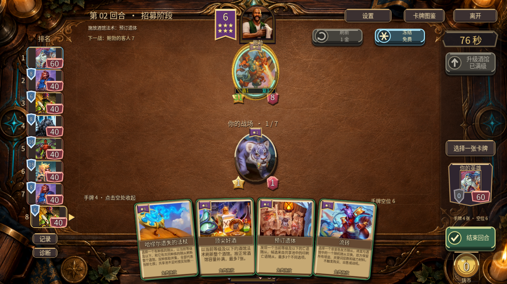
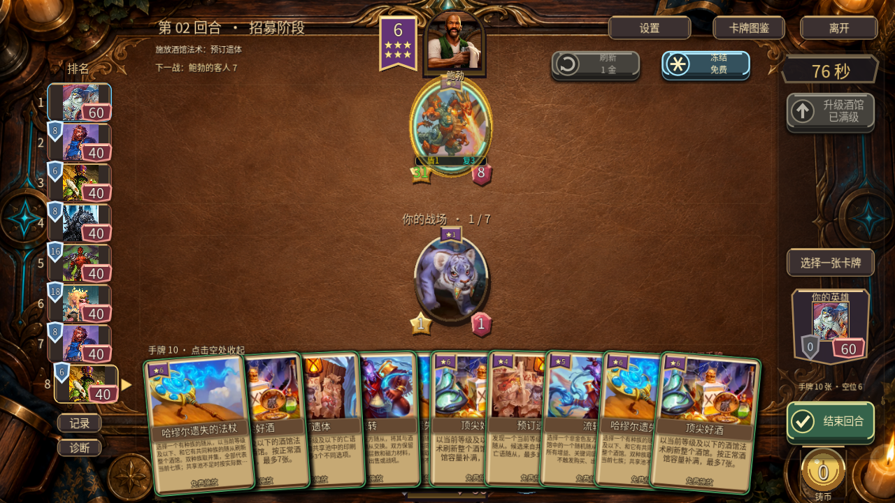
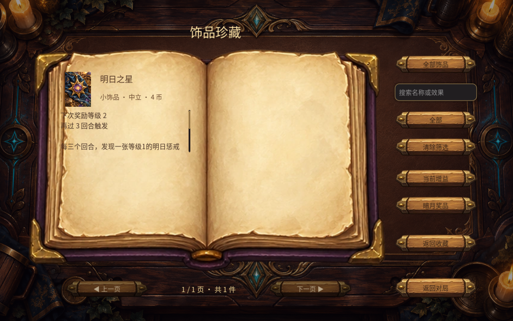

# v0.50.0 开发阶段：四法术与商店交互

2026-09-16。开发分支已实现，尚未发布新 APK／EXE，公开安装包仍 v0.49.0。当前开发池为 207 条随从定义、152 张在池随从、41 张法术、22 英雄。#25 与 #18 保持开放，完整交付后再回复关闭。

## 实装

|法术|历史版本与本作参数|关键行为|
|---|---|---|
|哈缪尔遗失的法杖|6 星／2 币|先读取目标七族成员并集，再返还旧商店并按池权重刷新；双族不重复加权。|
|顶尖好酒|28.2，6 星／2 币|刷新完整容量的全法术商店，最多七张。|
|预订遗体|28.2，4 星／3 币|发现当前等级及以下在池印刷亡语随从，候选不足显示实际数量。|
|流转|28.6.2，5 星／1 币|非金色友方与随机酒馆随从交换实体，保留增益、叠层和磁力材料，不触发买卖或战吼。|

两个刷新法术均不额外扣 1 币或免费刷新次数；冻结保留特殊商店，普通刷新恢复正常混合商店。发现预留/返还、满手、无候选、金色禁选、实体交换后三连均有回归。AI 每回合最多主动用两次刷新法术，保护印刷/继承亡语及磁力核心；复查补齐纳迪娜和低音提琴鱼人。

房主与客户端使用行动序号和源/目标 UID 校验，拒绝过期及重复请求；观战切换不借用被观看者的行动序号。协议已升至 `allstars-0.50.0-ws`，不与旧包混用。商店显示独立星级旗与实际售价，已购手牌显示免费施放；法杖拖拽显示目标种族，空处松手撤回。刷新共用逐张揭牌，交换提示不再冒充 +0/+0 增益。恢复已装备明日之星下次等级和倒数，放在说明首部无需滚动。

## 真实截图对照

重新查看用户实际截图 `6c984d0c…/1-Photo-1.jpg`（电脑）、`2-Photo-2.jpg`、`3-Photo-3.jpg`（手机）；手机展开对照主要使用图三。上传参考仅用于本地比较，不重复上传。下表比较对应操作结构，测试固定阵容与参考阵容不同，不把内容差异当成 UI 差异。

|体验点|参考截图与当前画面的差距|本轮结果／剩余工作|
|---|---|---|
|微扇形平铺|电脑在英雄下方；手机默认右下收纳，展开后轻弧度与小倾斜|保持双端规则，4/10 张、16:9/20:9、2D/3D检查通过；首次点击只展开。|
|手牌纸页|原版文字更干净，当前小牌原先重描边发糊|法术小字改深色纸面文字，长文省略并可查看详情；原版拱形卡框和弧形名条仍待做。|
|星级与费用|原版标记形状不同，读数一眼分开|增加紫色星级旗与金色售价，实际免费报价同步显示0，施放不再显示购买费。|
|指向操作|指向时应集中显示当前结果，当前旧悬停说明与新提示曾叠字|拖拽仅显示种族/交换提示，放开恢复普通说明；取消不消费。|
|商店更新|刷新要有明确的新卡进入顺序|两个刷新法术接入普通逐张揭牌，避免虚假 +0/+0 轨迹。|
|交换反馈|换位不是属性成长|实体动画跟随 UID；单行“与酒馆交换”置于目标上，不占英雄名字位置。|
|英雄与手牌|手机整排展开可能遮挡中央头像|沿用已完成的右侧只读血甲牌。|
|桌面和卡框|当前纹理密度、金边对比仍高，方形纸牌与参考差异明显|下一步共用拱形卡框/弧形名条，降低台面纹理；新图按4–6格图集制作。|
|计数与收藏|已装备明日之星分页后遗漏奖励进度|恢复等级和倒数，实际原生图见下；普通收藏条目不伪造局内状态。|

## 验证边界

- 55 个唯一相关套件，1670 条断言通过；四法术规则73条。初次UI批次的两个失败及修复后的日志均保留，最终汇总不重复累加重跑。
- Windows 原生四法术 UI33条、已装备饰品/转盘旧功能5条通过；19张截图。截图来自实际 Godot 渲染，固定QA阵容及76秒显示不是自然完整对局。
- 两个独立 Godot 进程同机 ENet 9条通过：种族刷新、全法术、普通刷新、交换、重放拒绝、观战切换。不是外部双机或实体手机验证。
- 规格与质量审查通过；未做平衡模拟、Android安装包、真机帧率/发热/音频实听。部分旧测试退出的资源释放警告原样保留。
- 命令、逐组数量见 [results.json](results.json)，图片来源与哈希见 [art-sources.json](art-sources.json)。

官方历史依据：[28.2](https://hearthstone.blizzard.com/en-us/news/24008697)、[28.6](https://hearthstone.blizzard.com/en-us/news/24056184)、[28.6.2](https://hearthstone.blizzard.com/en-us/news/24056185/28-6-2-patch-notes)。中文名按卡 ID 核对，修正设计稿的“预定遗体/流变”为“预订遗体/流转”。

完整发行仍需卡框/桌面改进、全局卡池文档更新、Android及发行包验证。见[下一阶段计划](../../下一阶段开发计划.md)。

源码本地提交 `2e51e7b`，公开证据提交 `df6c635`；#25/#18进度回复已读回确认。[同步记录](publication.json)。
