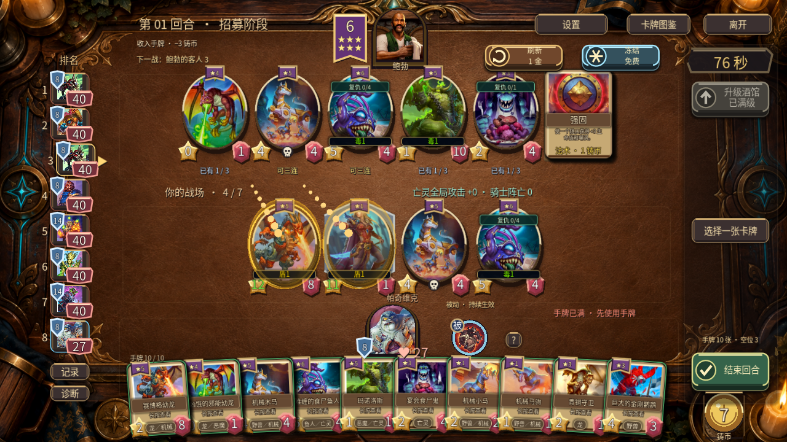
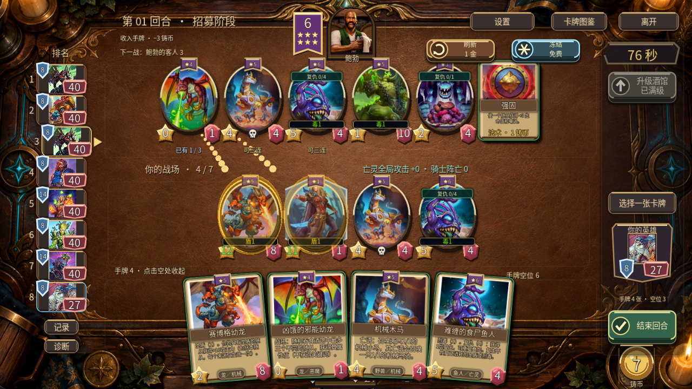
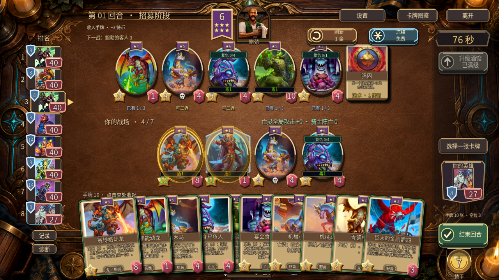

# 第二组六张：条件光环、召唤链与手机展开信息

2026-09-16。本阶段属于 v0.50.0 开发分支，公开 APK／EXE 仍为 v0.49.0。依据 [七族设计](../../v0.50.0-七族卡池设计.md)推进 #25，并继续检查 #18 的真实画面差距。没有做胜率模拟。

## 已实现内容

|卡牌|定位与适配|
|---|---|
|赛博格幼龙|5 星龙／机械，圣盾（1）；友方有盾时 +10 攻，金色 +20，包括自身。盾层数不乘加攻，破最后一层或来源死亡时撤消。|
|凶饿的邪能幼龙|4 星龙／恶魔，吞食最多三个不同酒馆随从；金色获得双倍当前属性，不复制关键词。铜须继续吞剩余实体，酒馆空了仍可打出。|
|机械木马|5 星野兽／机械，亡语生成两个机械小马，小马再生成马驹；两个衍生物同为双族，不占常驻池。金色继承金色身材，遵守七格。|
|难缠的食尸鱼人|6 星鱼人／亡灵，烈毒（1）；复仇（4）增加复生（1），金色增加两层。可重复叠加；复生仍为 1 血，不恢复已消耗的盾毒。|
|玛诺洛斯|5 星恶魔／亡灵，烈毒（1）；自身击杀且完整伤害与反击后存活，每场一次获得死者攻击和最大生命，金色双倍。复生不刷新该次数。|
|宴会食尸鬼|3 星亡灵，复仇（1）给每种族一个不同随从 +3 攻，金色 +6；仅本场战斗有效，融合怪只占一次。|

本阶段之后共 **207 条随从定义、152 张在池随从、37 张法术、22 位英雄**。魔瘾结晶者 `crystal` 已退役并保留图鉴。七族按成员资格计数：野兽 20、鱼人 20、龙 21、机械 19、恶魔 21、海盗 22、亡灵 22；双族会出现在两个统计中，不能将它们相加当作实体数。实际引擎导出见 [catalog.json](catalog.json)。

攻击光环由规则、AI、快照、3D 卡面和详情共用；卡面来源说明区分永久属性与条件加攻。检查发现并修复了从操作按钮打开原始实体详情时漏算光环的问题，同时防止对已经绘制的数值重复相加。

## 真实截图对照

参照用户上传的实际战棋桌面图一、手机图二／图三，而非生成概念图。对照图片仍保留在本地附件；此处仅发布本项目实际引擎截图。桌面 1280×720，手机布局开关模拟 1280×720 与 1600×720；不是 Android 安装包或实体设备验收。测试固定阵容与可见时钟，不是自然完整对局。

|位置、优先级|真实酒馆战棋与当前差距|本轮动作／后续验收|
|---|---|---|
|P1 微扇形手牌|真实桌面在英雄下方常驻、手机先收纳再展开；当前双端结构一致，仍保留浅弧与小角度重叠|本轮保留原有尺寸、位置及命中区；实际检查四张／十张、首次点击与出牌拖拽。|
|P1 展开时的英雄信息|当前手机大手牌覆盖中央英雄，原版截图也存在遮挡；玩家仍需随时知道自己的血甲|在右侧空闲位置补一个只读英雄血甲牌，不增加按钮；收起、详情、发现和饰品选择时隐藏。战斗采用回放时序，未结算时不能显示未来的死亡。|
|P1 随从属性解释|动态圣盾光环容易使卡面与详情出现不同数值|同一贡献值用于当前卡面、战斗快照和详情，2→1 保留、1→0 撤消、补盾恢复、来源死亡撤消；显示绿色增益数字，不写入永久攻击。|
|P1 插画焦点|原版让小尺寸卡图保住脸和关键道具；机械木马及小马默认居中裁切会切掉头顶|增加共用来源裁切边界／焦点，应用于手牌、详情、收藏、椭圆和 3D 纹理；重新检查两个马头完整，保持等比。八张图均按真实卡 ID 对应。|
|P1 卡框轮廓|原版拱形图窗、弧形名条、纸页连接自然；当前手牌仍明显偏矩形和横直条|尚未改完。下一步用一批共用手绘框／纸页素材，在同一浅弧布局上替换；不靠放大扇形掩盖轮廓差异。|
|P1 桌面和色彩|原版桌面更干净，冷暖分区更明显；当前暖棕密纹理、边缘金线较抢眼|尚未改完。压低非交互底纹和边缘高光，保留接触阴影，先保证主体辨识，不添加更多雕花粒子。|
|P2 手机高密度文字|十手牌仍有大面积重叠，小效果文本不能直接完整读；原版也依赖放大查看，但轮廓更有辨识性|本轮验证大卡详情和展开交互可用；后续结合卡框改造与实体手机的长按、误触、帧率反馈继续调整。|

本轮是上述局部复查，不用这些静态截图宣称 #18 所有页面、动画、音效或长期帧率已验收，也不重写全量评分。

### 画面证据

桌面十手牌：

手机四手牌及独立血甲：

手机十手牌：

其他画面：[收纳态](screenshots/v50-second-mobile-folded.png)、[圣盾光环](screenshots/v50-second-shop-aura.png)、[破盾后](screenshots/v50-second-shield-lost.png)、[2D 回退](screenshots/v50-second-mobile-four-2d.png)、[20:9](screenshots/v50-second-mobile-wide.png)、[展开中查看详情](screenshots/v50-second-mobile-detail.png)、[双族衍生物图鉴](screenshots/v50-second-token-collection.png)。六张随从与两个衍生物的完整详情各有截图，同目录可查看。

## 验证范围

最终相关功能回归 **42 套、1424 条断言通过**，六张规则专用 85 条。Windows 原生 UI **32 条检查通过**、保留 **18 张实际截图**；规则与 UI 均已完成规格和质量复查。测试重跑不重复累加。结果与命令见 `results.json` 和 `run.log`。规则通过独立规格和质量复查；UI 另外核对绘制数值、实际拖拽、手牌交互、模态隐藏、战斗血甲时序与图鉴。使用 Godot 4.6.1、Windows OpenGL 实际渲染。

- [原生运行日志](native.log)，截图是实际游戏画面。
- [功能套件与断言统计](results.json)，[完整执行日志](run.log)，分套件日志在 `logs/`。
- [资产身份、来源与哈希](art-sources.json)，包括八张对应原图；未生成新插画，原图文件未上传公开文档仓。
- [源码范围与哈希](source-files.json)、[证据文件清单](manifest.json)。源码只提交本地，公开仓继续仅保存约定文档和证据。
- 本阶段未发布 APK／EXE，未做 Android、实体手机性能、双客户端、音频实听或平衡模拟。部分旧短测试退出的引擎资源告警保留原样，不作零告警承诺。

## 未完成范围

四张法术、指定种族并集刷新与实体交换、完整卡框和桌面优化、Android／双客户端及完整发行验证仍未完成。#18／#25 保持开放；下一步见 [开发计划](../../下一阶段开发计划.md)。
