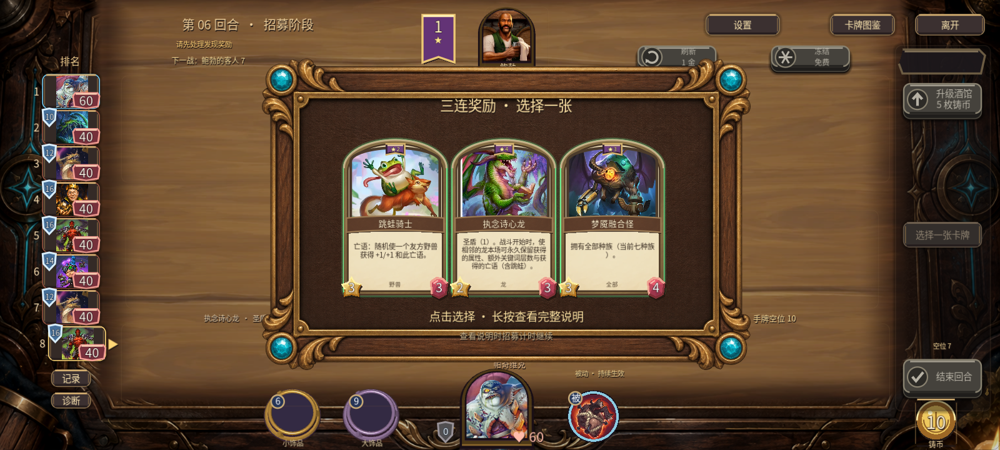
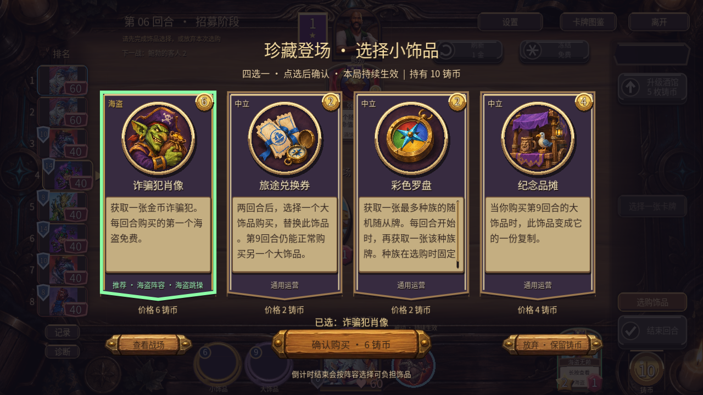
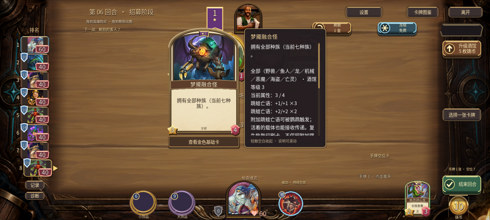

# v0.51 开发：诗心龙记忆与奖励交互

本轮修复 #26，继续落实 #18 的奖励选择体验。正式下载仍是 v0.50.0，本次没有导出或发布新的APK/EXE。

## #26 根因与修复

全部种族已经通过统一种族接口被识别为龙；实际缺口在战斗记忆只保存攻击/生命和关键词层数，没有保存 `leaps` 和 `extra_deathrattles`。因此诗心龙邻位融合怪能保留跳蛙属性，却丢掉传递亡语；擎旗空中海盗赋予的亡语也未带回招募。

- 按原始实体累计本场新获得的跳蛙层数与追加亡语；重复快照不重复记账，已有附魔不在下一场重复回写。
- 普通/金色诗心龙都保留新增亡语；金色仍只翻倍保留属性，不额外翻倍亡语数量和关键词层数。
- 支持多个回合累加、不同强度跳蛙、目标阵亡后结算、复生后再次获取。复生实体依旧回到印刷卡，不复制旧附魔；回写给原招募实体的总收益保留。
- 三连合并三份已保留跳蛙层数；附加海盗亡语在下场实际召唤、跳蛙在下场实际传递均有回归。
- 诗心龙/泰蕾苟萨文字与全局卡池同步；详情明确全部种族算龙，将误导性的“额外磁力亡语”改成“附加亡语”。

## 奖励界面差距与本轮处理

以用户6c984d0c批次真实战棋截图为既有参考：奖励选择应突出候选卡和完整效果阅读，操作反馈要区别“阅读”“选择”“付款”。本轮复用现有素材，没有重画卡图或修改手牌几何。

|问题|此前行为|本轮改动|后续|
|---|---|---|---|
|发现/三连不能先读详情 P1|鼠标/触摸模拟按下就领取，长按详情来不及出现|短按松手领取；长按只查看完整效果，增加选择高亮、操作与计时提示|统一奖励揭牌与音色，录屏验收|
|饰品正文滑动误选 P1|拖动后回到原点松手仍被视为点击|超过移动门槛后整次手势不再变回点击；取消触摸/未配对松手不选择|实体安卓滑动和长局检查|
|饰品付款对象不够明确 P1|确认按钮只有价格|按钮上方明确“已选：名称”；未选显示阅读提示|后续改善四选一装饰层次|
|永久亡语说明不准确 P1|附加亡语被一律称为磁力来源|使用通用附加亡语名称，解释诗心龙全部种族和金色倍数|更直观的来源汇总可另做|

仍可从真实截图看到：当前发现候选卡占屏比例偏小、外围厚框占地较多，也尚缺隐藏奖励查看战场的入口。这轮优先修复阅读/选择误操作，没有声称奖励界面已完全还原；后续视觉调整需同步验证满手警告与手机命中区域。

## 验证

**11套 / 346项成功检查：7套headless规则167项，4套Windows原生UI179项。** 全部退出0，无脚本或着色器错误；规则中有固定种子的真实战斗，不是胜率平衡模拟。[逐套结果](results.json)与日志同目录。

诗心龙初始复现10项中7项失败；最终扩展为15项全部通过。奖励交互最终18项，包括16:9/20:9、正文拖动/触摸取消、未配对松手、长按发现不领取、短按只领取一次、详情标签。原始奖励测试的8项失败包含首项误选后的后续断言，不能当作8个独立bug。修正测试隔离后通过。其余套件覆盖叠层、跳蛙、海盗、全部种族、饰品付款、满手发现、双端手牌及2D/3D卡面。

本轮为主线程代码检查及自动回归，没有另行声称独立审查。原生手机布局覆盖不是Android真机或最终安装包；未验证外部双设备、音频实听与实体手机性能。未改系统电源、驱动、代理或网络。

## 截图

[九张截图及尺寸/哈希](screenshots.json)。长正文测试图使用合成压力文本；普通饰品截图为真实卡文，继承效果详情为确定性构造的展示样本。规则是否实际结算由规则用例验证。

## 下一步

优先整理v0.51候选包：合并已完成的英雄界面、桌面/阅读和本轮修复，统一版本号，再做APK覆盖安装与触控、EXE普通流程和最终客户端同步。其后继续奖励揭牌、目标指向和英雄攻击的录屏/有声验收；#18其余范围保持开放。
