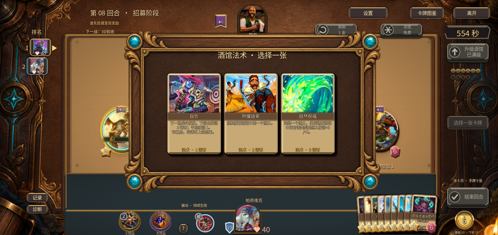
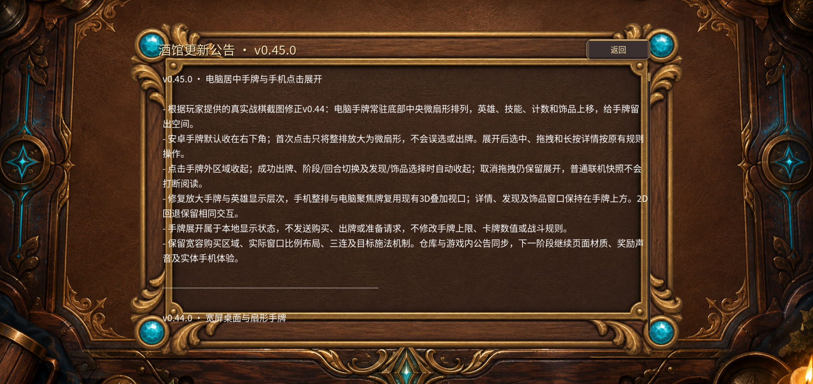
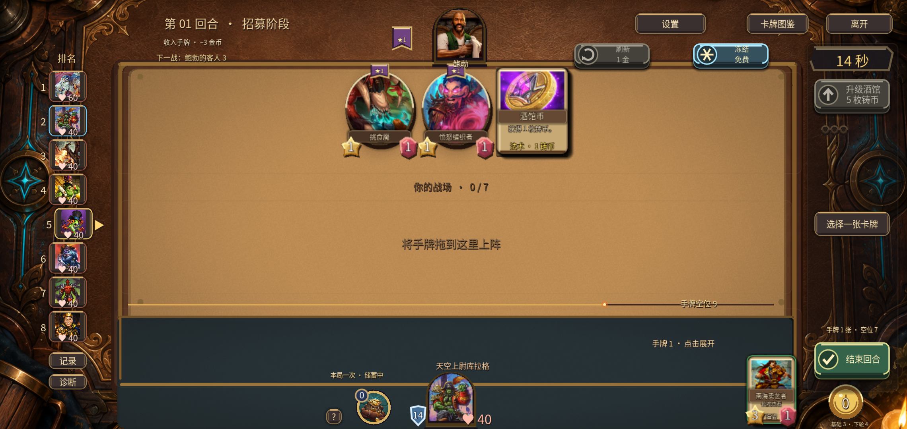
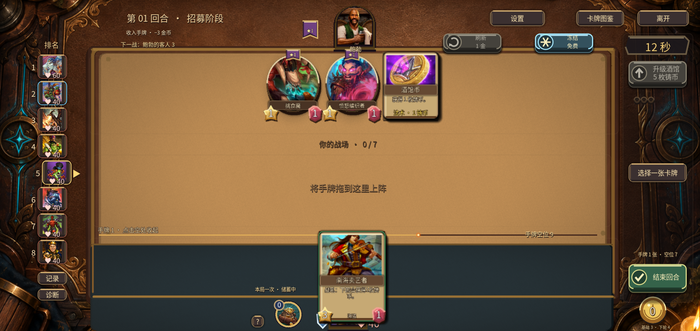
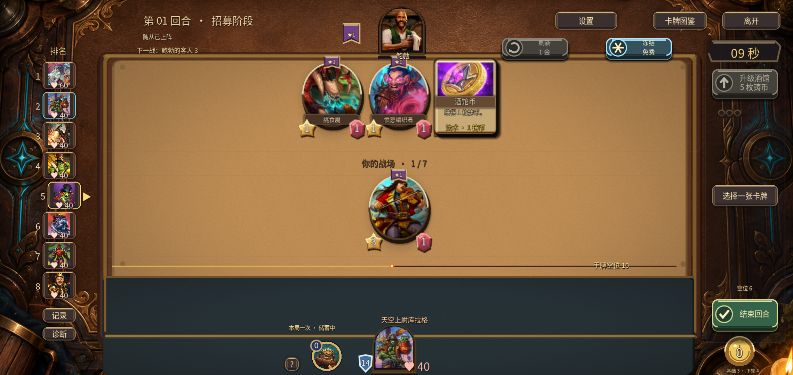

# v0.45.0 · 微扇形手牌证据

[改动与下一步](../../v0.45.0-双端手牌布局.md) · [验证范围](VERIFICATION.md) · [10套结果](suite-results.json) · [安装包校验](artifacts.json)

## 电脑居中微扇形

## 安卓最终APK

[40秒安卓触控录像](v45-hand-preview.mp4)。预置QA局面，无音轨。模拟器不能代替实体手机长局体验。

## 自然单机首回合

