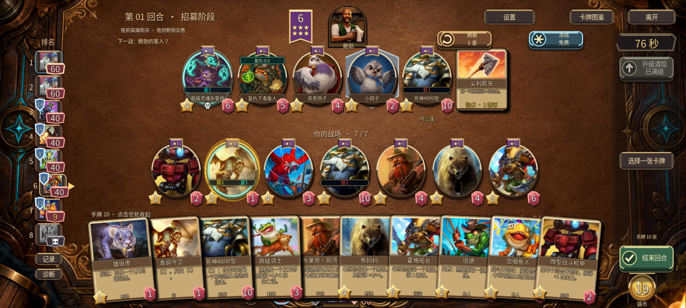
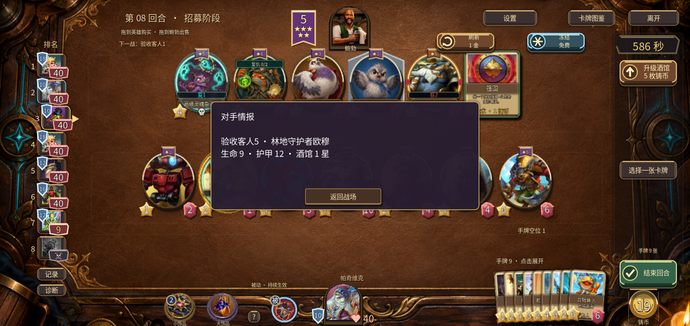
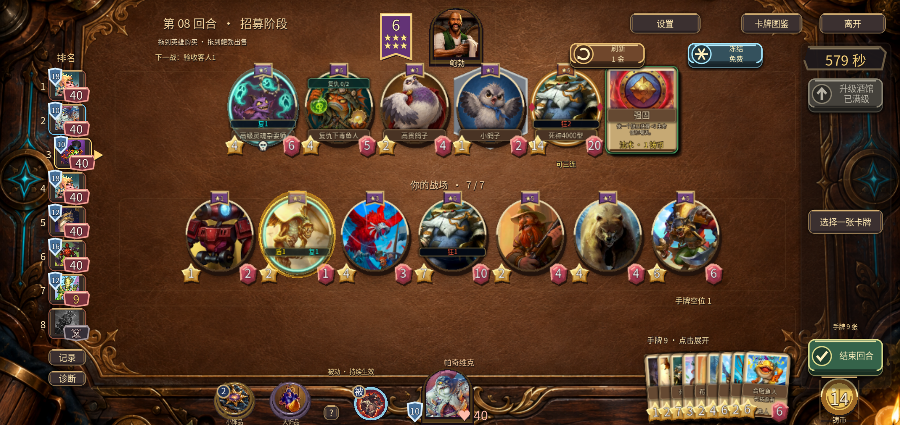
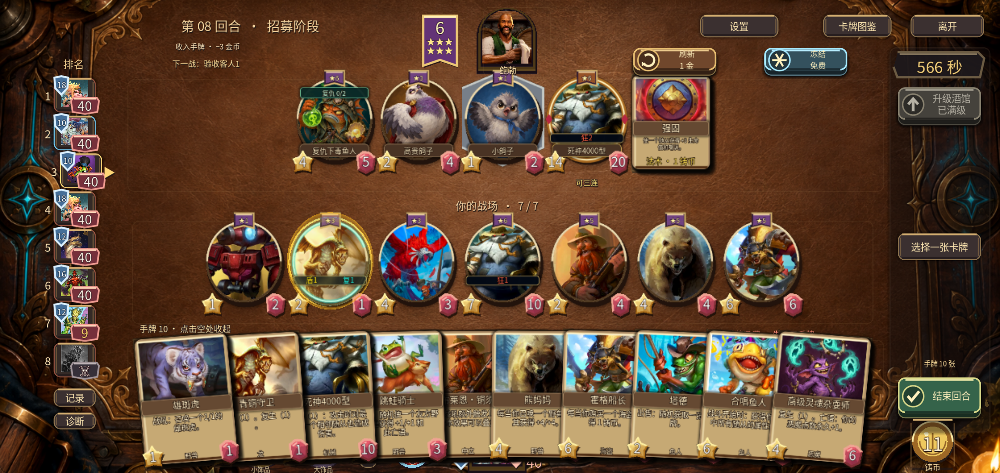
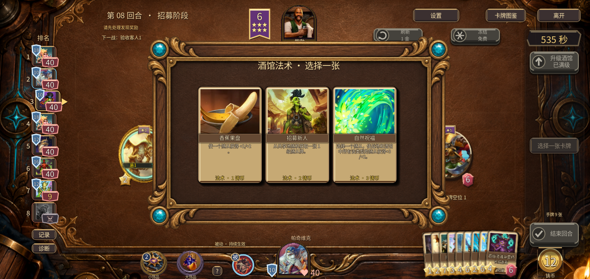
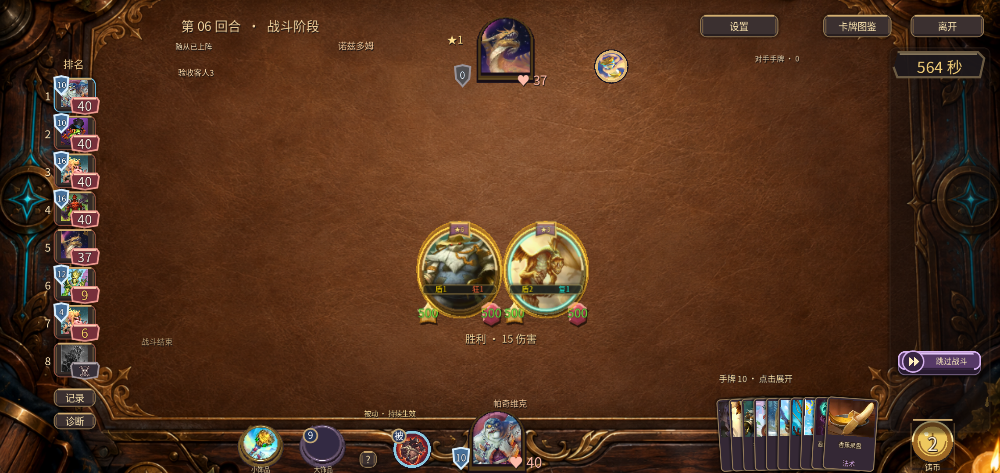

# v0.46.0 · 深色台面与信息层级证据

[改动与对照](../../v0.46.0-台面与信息层级.md) · [验证范围](VERIFICATION.md) · [12套结果](suite-results.json) · [安装包校验](artifacts.json)

## 原生Windows

## 最终安卓APK

[55秒安卓操作录像](v46-ui-preview.mp4)。预置QA局面，无音轨；不替代实体手机长局测试。

公开日志仅清除行尾空格，原始 Android 日志保留于本机 `.runtime/v46-android.log`。
