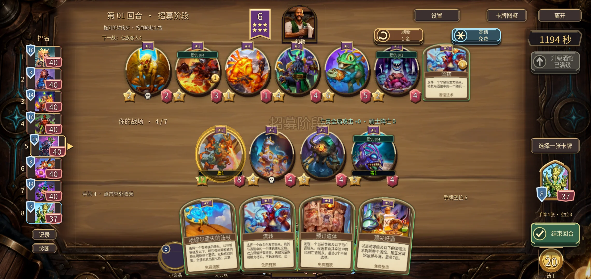
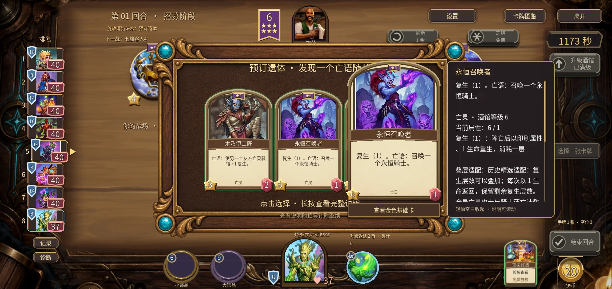
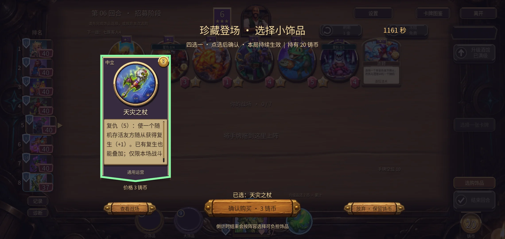
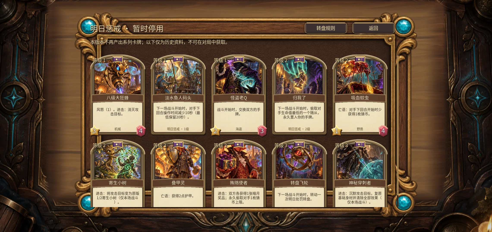
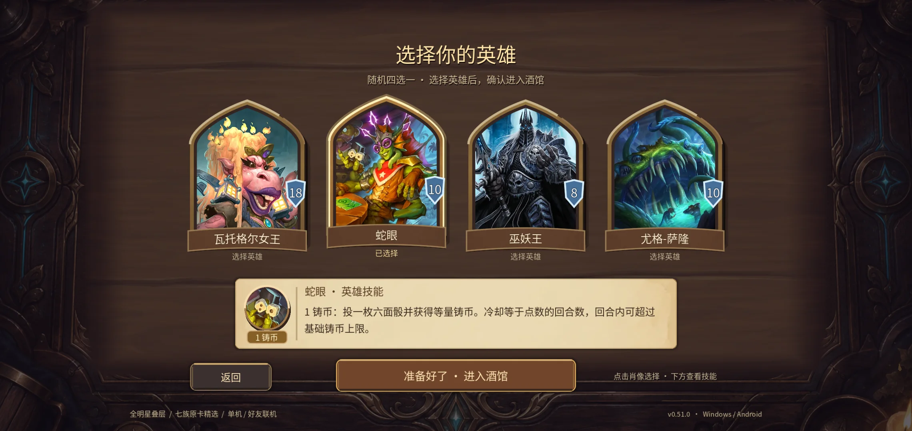
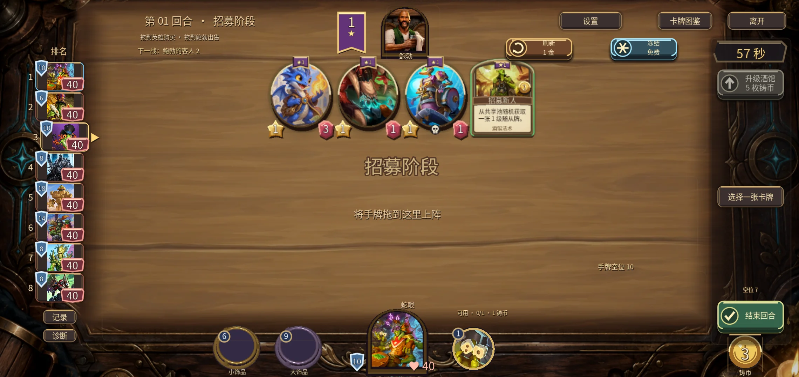

# v0.51.0 验证记录

本目录对应实际发布的APK和Windows EXE，不是仅源码预览。

- 16套Godot功能/原生UI回归，检查明日停用、英雄选择、阅读页、诗心龙、叠层、发现、饰品、双端手牌、卡面及历史归档效果；见regression-summary.json及logs。普通暗月另外66项通过。六项Python表格测试与新生成Godot Catalog一致。
- 最终EXE两个独立进程：购买、出牌、酒馆法术、战斗回放、私有快照通过，客户端3D开启。此为同机验证。
- 最终APK安装在API33 x86_64模拟器，host GPU；版本54/0.51.0，与v0.50签名一致。实际触控覆盖四牌/十牌展开、拖拽购买和出牌、四种新法术、发现长按不领取、短按领取、饰品选中后确认、停用图鉴、公告、英雄选择与单机。
- 首轮Android测试有两处旧坐标失配：详情关闭点击落在面板内、单饰品点击仍用旧居中坐标；截图定位后改为点击空白和第一个槽位，后续实际操作通过。原始失败记录保留，不掩盖。
- 已归档Tomorrow动画测试与最终EXE headless房主退出时提示一个资源仍被引用；运行断言通过，无脚本/着色器报错，退出诊断尚待后续清理。
- 未做平衡模拟。无实体Android长局/发热/性能测试，无音频实听，无外部双设备验证。测试未更改电源、驱动、代理或网络配置；使用现有模拟器与临时QA进程。

## 最终APK截图

## 资产

artifacts.json与SHA256SUMS.txt记录最终文件摘要；github-assets.json记录发布回读；download-verification.json记录公开下载校验。
