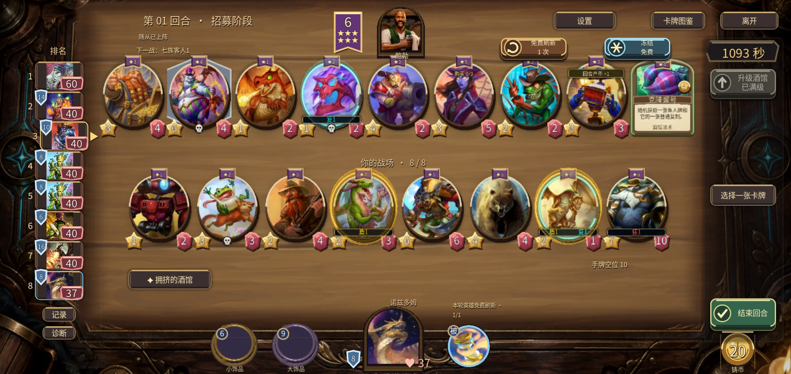
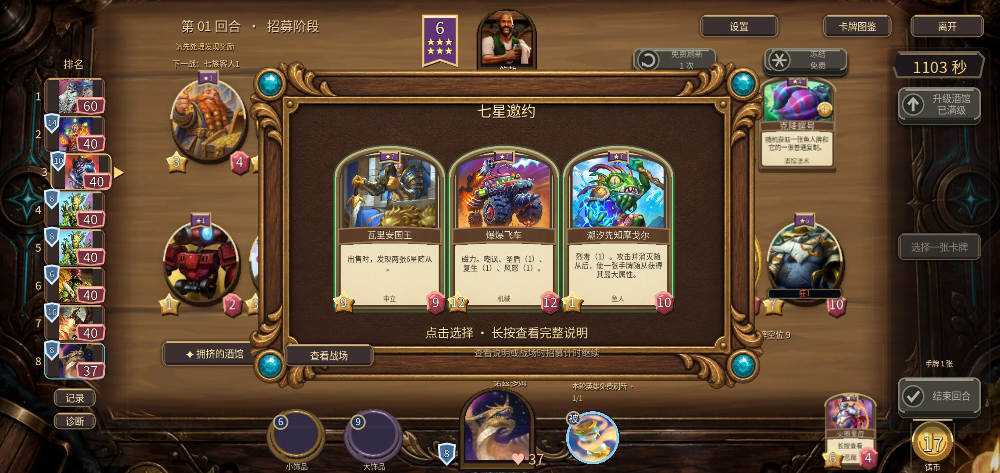
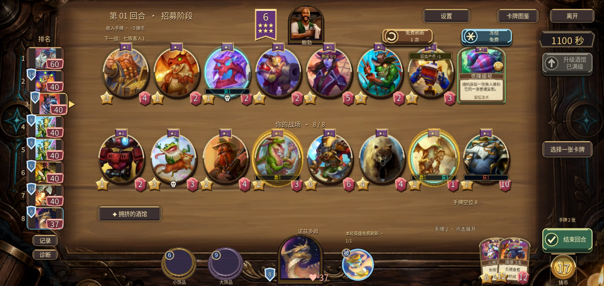
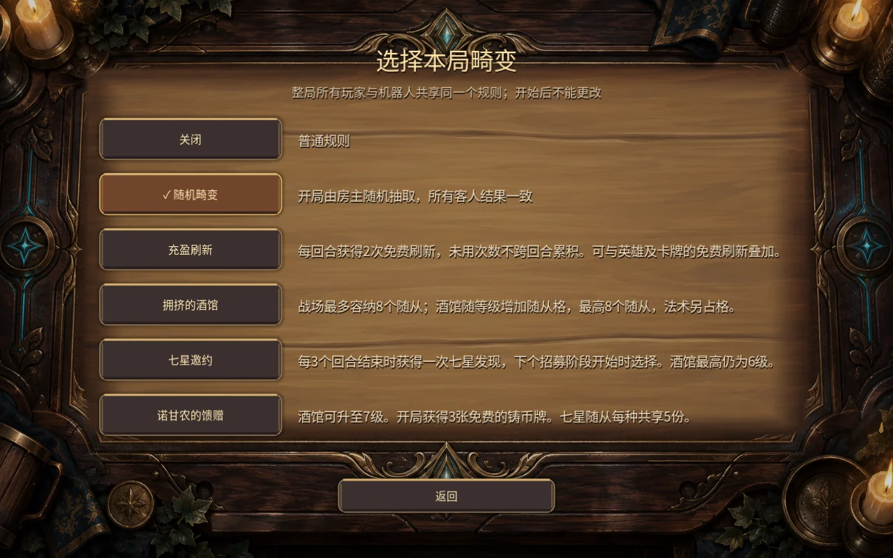

# v0.52.0 验证与边界

- 11套功能/原生UI回归全部通过：初轮283项，针对摩戈尔永久手牌增益、反击无收益与发现到期补验3项，总计286项不同断言。logs/results.json 与 supplement 日志可核查；并非胜率模拟。
- 独立WebSocket两进程新增7项：共享畸变结果、非房主不能修改、开局锁定、第八格上场与七星奖励同步。最终EXE另做双进程购买、出牌、酒馆法术、战斗回放、私有快照和断线接管验证。
- 最终APK实际覆盖安装：API33 x86_64模拟器、host GPU，versionCode55/0.52.0。触控验证八格商店、八格战场、购买、发现查看/返回与七星领取。android-actions.json 保留首轮失败：宽屏返回按钮不采用居中坐标，且预览图片被缩小；按照原始图片尺寸换算后实际返回和领取通过，不是游戏丢失奖励。
- 卡池文档Python 5项通过，1项依赖额外Catalog快照的比较未运行；Godot Catalog已在功能套件验证。初轮断言仍写旧207/150，已更新为215/158并重跑；普通150+条件七本8单独说明。
- Android签名验证通过，覆盖安装成功；现有试用签名。正式资产摘要见 artifacts.json/SHA256SUMS.txt，GitHub上传回读及公开下载另列。
- 未做平衡模拟、实体Android长局/发热、音频实听、外部双设备联机；模拟器及同机联机不能替代上述验收。未改动系统电源、网络、代理或驱动。#18剩余视觉/有声体验继续开放。

[规则、适配与官方参考](../../v0.52.0-畸变与七星珍藏.md) · [下一步](../../下一阶段开发计划.md)
