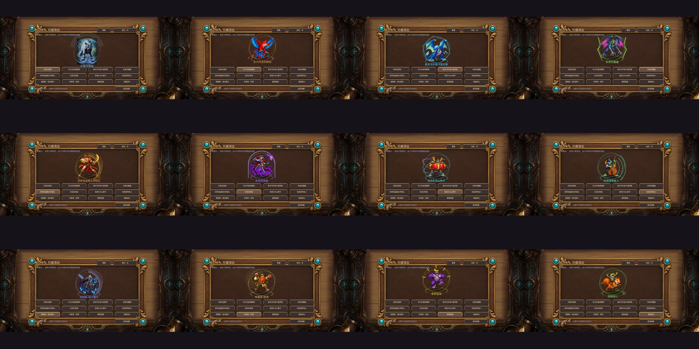

# v0.58.0 验证

2026-09-23，Godot4.6.1 / Compatibility / 3d。本次14个运行脚本合计458项断言：其中457项机制/UI、1项完整演出性能场景确认。未做平衡模拟。

## 实际检查

- 新3D场景44项：真实拖拽上场、透传购买、独立可见层、16:10/20:9的12卡预览、固定狼爹姿态、尾帧停止视口更新、重播/保留选择/金色外环、窗口缩放、2D/低档/减少动态/低特效回退、离开清理及密集短版上限。
- 原机制48项、UI47项和工作流20项继续通过；16帧包含原生屏幕采样和早期红眼像素检查。其余回归覆盖v56/v53规则、龙全部新增buff记忆、亡语传承、叠层与进击时序、双端10手牌和发现/详情。见logs/results.json。
- 源码测试的所有游戏代码与最终导出一致；导出后仅修正缩放测试夹具暂停主循环时的旧尺寸同步，最终44项日志已重新运行并更新统计。
- 最终APK已签名验证并覆盖安装，versionName0.58.0/code62，与0.57签名一致。API33 x86_64模拟器12卡逐个触控，普通/金色、重播及超过时长后保留尾帧有截图。
- 同一最终APK15项实际触控/服务端状态断言：协议、手牌首次点击仅展开、狼爹拖出、继续购买、鹦鹉/召唤者/B-Box/金狼、连锁、3D着色器无脚本错误、关闭/完整/2D设置和重启保存。另有3次应用冷启动前台/进程检查、公告与单机选将进入招募截图。
- 最终EXE同机双进程买随从、出牌、买法术并定向施放、准备、回放、私有快照、断线AI接管通过。源码verbose与最终EXE这两次没有旧房主ObjectDB残留；没有根因修复，仍跟踪#18。

## 性能样本

RTX5060 Laptop、画质中、60fps上限。完整狼爹关闭/开启各360帧，开启组三次包含冷载入：P95为16.702/16.692ms，P99为16.817/16.812ms，最大16.876/29.129ms。全渲染器纹理监控102778597/112460753bytes；新增视口只在大演出期间存在。短版各240帧P95为16.702/16.704ms。

帧间隔含调度等待，不等同GPU时间；桌面短样本不证明实体手机发热或长局稳定性。图鉴尾帧的视口停止刷新由断言直接检查，不是凭FPS推测。

## 问题与边界

- 模拟器刚开机、安装后的第一次启动在横屏重建时退回桌面；日志为Activity销毁/EGL_BAD_SURFACE/Godot终止，未出现脚本或新着色器编译错误。重新启动正常，后续连续三次应用冷启动通过。没有声称根治此首次启动现象，#18继续跟踪。
- 冷启动检查第一次误用了dumpsys window windows，其输出没有焦点字段，导致测试假失败；实际截图是正常主菜单。改为dumpsys window后通过，保留android-harness-first-attempt.json。
- 原生新增UI测试最初发现UPDATE_ONCE状态不便可靠断言，已在frame_post_draw后明确停掉视口；窗口缩放夹具暂停主循环导致旧尺寸过期，修正夹具后通过。
- 01-menu/02-collection是首次启动退出时的桌面，不算游戏菜单验收；03-relaunch、cold-launch-1至3才是启动成功截图。
- 19-release-notes、23-final-journal、30-journal-100ms的截图过早，仍显示菜单；28-journal-long与等待完成后的31-journal-settled才显示公告。100ms短按也能打开，长公告初次排版耗时需后续优化，没有把过早截图当作按钮失效。
- 单机选将过程中另有一次can_process/is_inside_tree的引擎告警，游戏继续进入招募；未声称日志完全无警告。
- 角色是带空间倾斜的手绘Mesh贴片，前后环/桌面层是真正3D；尚未制作独立肢体骨骼。未验证真机长局、音频实听或外部双设备联机。
- 本轮没有关机、修改系统网络/代理/驱动/电源。只创建并停止自身测试进程。

## 发布复核

v0.58.0已设为latest。4件发布文件均实际通过公网下载并完成SHA-256/字节数比对，见download-verification.json；APK/EXE/ZIP不是只检查上传成功。#31与#18均已回复并保持开放，见issue-followups.json。上传重试仅对独立GitHub上传进程使用NO_PROXY，没有修改系统网络、代理或电源配置。
