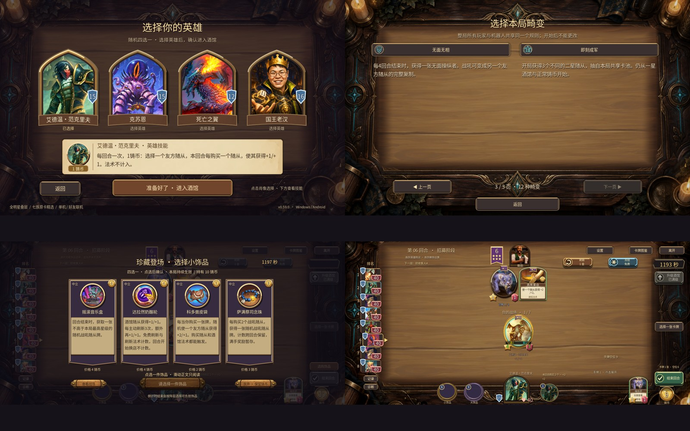

# v0.59.0 验证与模拟

2026-09-23，Godot4.6.1 / Compatibility / 3d。最终APK versionName0.59.0/code63，签名与0.58一致，已覆盖安装API33 x86_64模拟器。Windows为嵌入PCK的发行EXE。

## 已检查

- 14个脚本493项断言通过，包括新规则42、新AI23、新界面12、双端手牌63，以及v56/v53、龙记忆、叠层、进击时序、法术与核心演出回归。见logs/results.json。
- 新机制覆盖：艾德温购买随从计数/非法目标不扣费、克苏恩逐次随机、死亡之翼双方永久增益与龙记忆隔离、周期奖励防重复、满手暂存、起手共享池、奶酪主动刷新、皮袋真实购买、念珠跨回合。
- 原生UI实际拖拽购买/技能指向、3新英雄原画/主动被动、畸变第三页、新饰品正文、公告最新/上一版/返回、电脑底部和手机收纳/展开的10手牌、2D回退通过。
- 最终APK10项触控/服务端状态检查：协议与艾德温、指向加成/扣币、购买计数、首点手牌只展开、4个新饰品送达、选购奶酪和扣币、3次刷新、克苏恩/死亡之翼快照，以及Android3D无脚本/着色器错误。英雄快照检查不等于实际战斗技能验收；技能规则由独立断言覆盖。
- 最终APK另做3次应用冷启动前台/进程检查，均通过。公告分页与单机选将/招募另有截图实看。
- 最终EXE同机双进程：买随从/上场、买法术并指向、准备、回放、隐藏快照、断线AI接管均通过。实际测试端口14271。不是外部双设备联机证明。
- HTML玩法表经Playwright在桌面1280宽和手机390宽查看，搜索“鹦鹉”返回2套（狼爹和跳蛙），表格可横向滚动。初始favicon404不影响内容。

## 正式模拟

312场完整8人对局，2496席位，17,538次实际战斗；另做28,800次固定阵容交战。名次唯一、逐回合卡池守恒、金币/场位/手牌边界通过；正式样本没有达到连锁或回合封顶。与训练种子分离，正式运行后未按结果再调AI。详见[报告](../../reports/v0.59.0/玩法强度与AI报告.md)和simulation/下JSON、日志、源码哈希。

新AI吃鸡15.5%/旧9.5%，前四48.2%/旧51.8%，平均名次4.489/4.511（差值95%区间跨0）。这是更高上限与转型风险的取舍，不能宣称全面胜出。固定模板中的T0不是真人天梯，也不代表经营成本相同。没有自动平衡改数值。

## 已知边界与失败记录

- 模拟器刚启动、安装后首次横屏启动退出到桌面：EGL_BAD_SURFACE、Activity重建、Godot SIG9。重新启动恢复，后续3次冷启动通过。旧问题仍未根治；01-menu.png是桌面，不计成功。
- 最终EXE房主退出仍报告ObjectDB和1个资源残留，功能测试通过不代表退出清理已修。#18继续开放。
- 安卓饰品夹具首次漏填trinket_choice_size，造成UI脚本错误；修正测试夹具与真实选择流程一致后重新连接/重跑，10项通过。保留android-harness-first-attempt.json和android-fixture-incomplete.log，不将该非法测试状态当成正常游戏失败，也不隐藏首次失败。
- 11-cheese-after-refresh截图处于刷新动画中，不用它证明商店完整呈现；新英雄稳定战场和新饰品正文另有截图。
- native/及Android截图均为实际游戏渲染；发布没有新增部位骨骼动画。手机真机长局、发热和音频实听，以及外部双设备网络未验证。最大机器人回合耗时852ms来自多进程负载，不是手机FPS。
- 本次未关机、改网络/代理/驱动/电源。只启动并停止本轮测试进程；临时HTTP仅绑定127.0.0.1用于离线报告预览，没有开公网游戏服。
