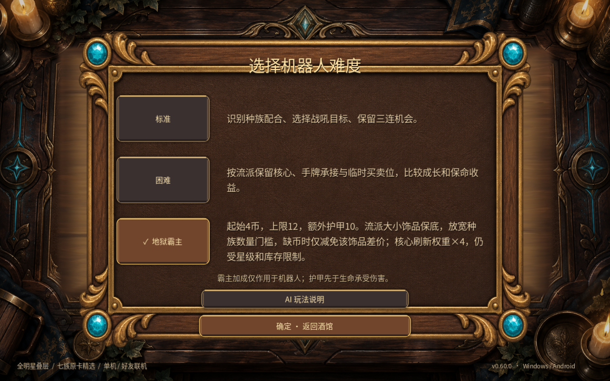
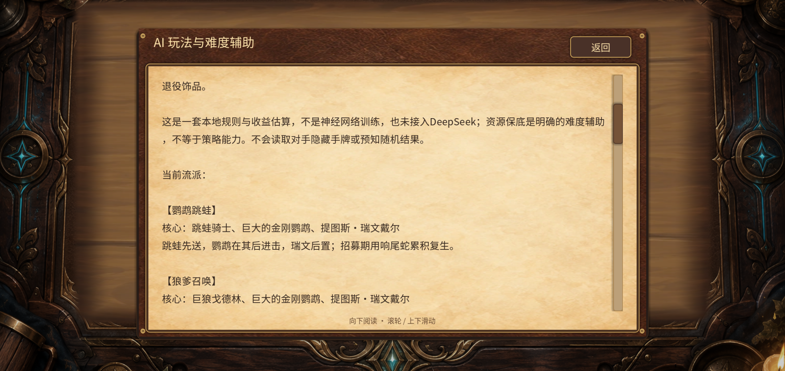

# v0.60.0 验证记录

2026-09-24，Godot4.6.1 / Compatibility，分支3d。本版没有胜率提升结论。

## 规则与完整对局

- 13个脚本合计379项断言：新玩法56、旧霸主44、饰品策略24、长期替换23、新内容42、旧AI15/10、卡池12、v56机制76、龙记忆16、叠层25、时序32和新UI4。逐项日志见logs/results.json。
- 16套流派×24个种子×小/大两种，共768次指定饰品报价和实际获取；包含0/1/2金币、普通玩家/困难不获补助、退役备选、原目录不变。
- 最终玩法代码的24场完整8人对局，共192席位、1348次战斗，覆盖全部29英雄、困难/霸主、饰品开关和多种畸变。188次到达选择时点的保底全部实际购入；495次新增资源循环。逐回合共享池守恒、金币/手牌/场位、准备状态、唯一名次检查通过；没有回合/连锁封顶。另有12局独立卡池回归。
- 这些是修复后功能种子，不是训练集之外的平衡基准，也没有新旧AI胜率对照。最高单机器人回合703.625ms出现在电脑并行测试负载中，不是安卓帧率指标。
- 第一轮功能检查抓到两次编织者自伤致死（种子606014/606019），现已补上安全判断并重跑。lobbies-12-first-attempt.json与单局复现文件保留失败记录；最终正式结果为lobbies-0.json和lobbies-12.json。
- 旧时序测试随机抽到死亡之翼会引入合法的永久战斗增益，使原断言误报。用例固定无相关技能英雄后通过；未删除时序断言。预估首战吼饰品时另外验证不消耗真实触发次数。

## 最终安装包

- APK versionName0.60.0/code64，三ABI，沿用0.59签名，覆盖安装API33 x86_64模拟器成功。测试辅助脚本首轮终端打印仍写code63，实际包信息及断言为64；打印已修正，不用终端旧文案代替包检查。
- 3次应用冷启动均保持前台。真实触控检查难度说明、选择霸主、AI说明入口/滑动阅读、返回、单机选将和招募；看到了16套手册中的跳蛙/狼爹段落。商店拖到手牌扣3币，手机首击仅展开；结束首轮后进入第2轮。
- Windows发行EXE同机双进程验证购买、上阵、法术指向、准备、回放、隐藏快照和断线AI接管。使用实际测试端口14271；不等同外部两台设备验证。
- 原生桌面难度长文全部可见，游戏内16套手册、公告最新版本内容断言通过。源码与数据哈希见gameplay-hashes.json；正式功能检查后未修改运行代码。

## 已知边界

- 安卓仍出现一次can_process/is_inside_tree引擎告警，以及缓存着色器重新编译警告；功能继续执行，没有GDScript/着色器编译错误。没有将该历史告警标记为修复。
- 本轮安装后和3次冷启动未复现上一版首次横屏EGL退出；本轮EXE未复现退出ObjectDB残留。由于没有修复相关根因，历史问题仍保留待查，#18不关闭。
- 没有手机真机长局、发热、有声实听或外部双设备测试。安卓中后期霸主饰品由相同源码的完整规则模拟覆盖，并未在模拟器手动打到第9回合。
- 没有开公网游戏服、修改系统网络/代理/电源或关机操作；只启动并停止本轮自己的测试程序。
