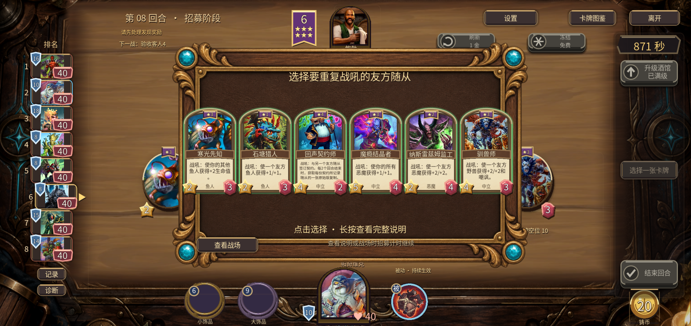
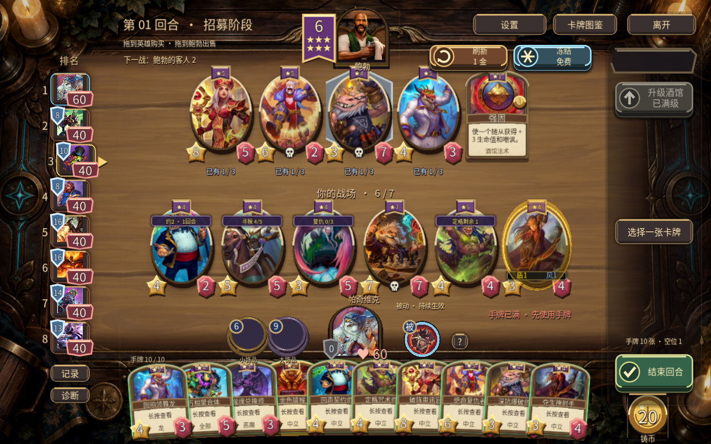

# v0.61.0 验证记录

2026-09-24，Godot 4.6.1 / Compatibility，分支 3d。此次交付新增12张在池随从、1张金猴衍生物及既有适配牌身份整理；没有进行新旧AI平衡比较或自动调整数值。

## 规则与完整对局

- 17套检查共535项不重复断言通过，包括63项新卡检查、8项原生桌面UI检查；逐套数量及日志见 [results.json](logs/results.json)。重复运行的断言未累加。
- 新规则覆盖契约原始复制、真实回合倒计时/达卡莱产出、三连合并、满手队列、布莱恩吞食同一UID、金猴主动刷新/满店补入/购买后奖励、抉择菜单不污染卡池、复仇获取、窃取复生、定格次数、实际击杀来源、非叠乘易伤、金色爆破单次伤害、金色参谋三金召唤与站位/空场/满场/提图斯边界。
- 定格咒术师复生保留已用次数，独立复制重置次数；敌方施加的3/3、嘲讽和易伤不进入龙的永久增益账本。最终复制修复后重新通过新卡63、v56机制76、基本规则32共171项检查。
- 8个新反制组合完整战斗均正常结束，未改动原始招募阵容。基本规则另完成10场8人对局；共享卡池专项另完成12场8人对局，发现/三连/磁力/淘汰后总量守恒。
- [6场完整8人功能对局](lobbies-0.json)覆盖全部29英雄、困难/霸主、饰品开关与多种畸变。共354次战斗、125次资源循环，47次大小饰品保底全部实际获取。逐回合检查金币、手牌、场位、卡池、准备状态及唯一名次，未发生回合或连锁封顶。它们是功能回归种子，不是玩法强度或AI胜率提升证据。

## 实际界面与安装包

- 原生Windows图形测试：桌面10手牌底部微扇形、全部新画加载、参谋详情、真实鼠标拖出领舞龙、二选一、六目标完整显示/点选结算、旧名检索及游戏内公告。截图位于 [native](native)。
- Android API33 x86_64模拟器，2280×1080，宿主 NVIDIA GPU。候选APK完成10手牌首击仅展开、参谋长按详情、真实拖出领舞龙→二选一→六目标→寒光战吼结算（岩池生命3变5），以及新反制战斗回放。APK与Windows测试房主通过10.0.2.2:14340实际连接；[目标选择结果](android-final/choice-result.json)来自房主状态。截图02–12属于此候选包。
- 最终APK在候选包基础上补独立复制次数修复，versionName 0.61.0 / code65，armv7/arm64/x86_64。覆盖安装、三次应用冷启动、公告、单机选将、拖拽购买/展开/上场、回合结算到第4回合通过；截图13–23及 [安装记录](android-final/final-install.json)属于最终包。没有把候选包全部交互写成最终包逐项重测。
- Android沿用原有debug导出和签名方式，v2/v3签名有效，证书SHA-256与v0.60.0一致；可覆盖旧版安装。不是新生产密钥的release导出包。
- 最终Windows EXE使用release导出，实际双进程验证注册、购买、上场、法术指向、准备、回放、私有快照、断线Bot接管。客户端原生3D显示通过；日志见 [network](logs/v61-final-network.log)。此为同机两个进程，不等同外部两台设备验证。
- 文件字节数与SHA-256见 [artifacts.json](artifacts.json)；实际玩法文件哈希见 [gameplay-hashes.json](gameplay-hashes.json)。最终安装包导出后未再修改运行代码。

## 已知边界

- 最初模拟器使用SwiftShader软件图形后端，灰屏并报告片段着色器统一变量容量限制，日志为 `GL_MAX_FRAGMENT_UNIFORM_VECTORS (261)`；[失败画面](renderer-probe/01-debug-menu.png)单独保留。重启本轮模拟器并使用宿主GPU后显示正常。这是更换测试环境，未宣称已修复全部Android GPU兼容问题。
- 安卓选将界面仍出现一次历史 `can_process / !is_inside_tree()` 引擎告警；之后正常购买、上场及进入下一回合。没有GDScript错误或宿主GPU着色器编译错误。#18继续开放，首次横屏生命周期和真机长局仍需处理。
- 没有实体Android手机发热/长局、有声实听、外部双设备网络验收。#31独立部位动画及新反制牌专属演出仍列在下一阶段，不以此次通用目标特效冒充完成。
- 未开公网游戏服务器，未修改系统网络、代理、电源或执行关机操作。

## 发布回查

[v0.61.0发行页](https://github.com/bjckbjckbjck-ai/classic-tavern-builds/releases/tag/v0.61.0)已公开，latest指向本版。4个附件的GitHub存储SHA-256与本地完整文件一致；匿名HTTPS下载检查均返回206，两个大包各核对前64KiB，小文档完整核对。这是公开可下载性检查加服务端完整摘要校验，没有声称重新下载完整的两个大包。详情见 [public-download-check.json](public-download-check.json)。

[#18已回复](https://github.com/bjckbjckbjck-ai/classic-tavern-builds/issues/18#issuecomment-5809655120)，保留已知安卓告警和真机验收待办。#31仍开放。测试房主和本轮无窗口模拟器已关闭；游戏源码保留在本地3d分支，公开仓库仅发布说明、验证证据及安装包。
